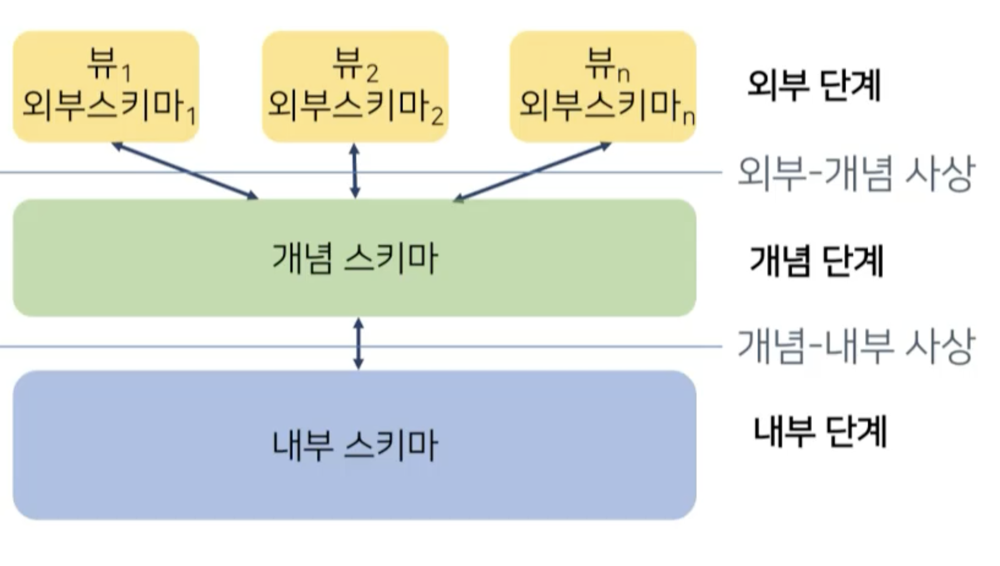
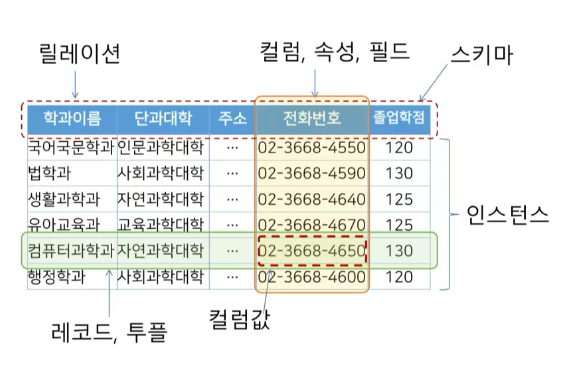
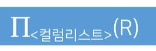
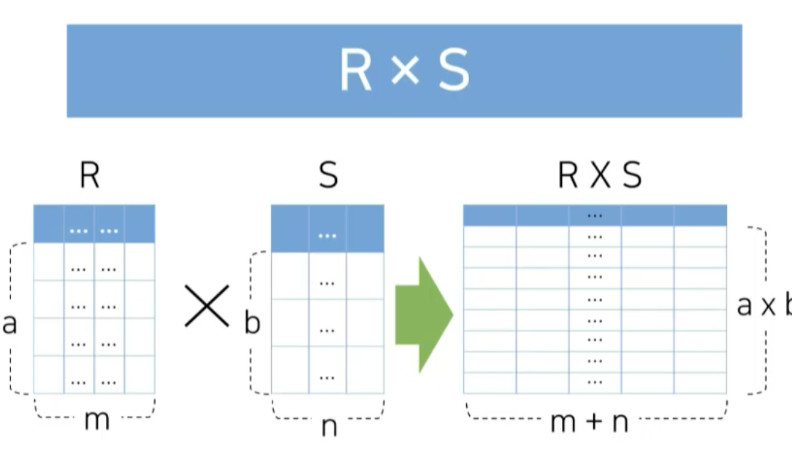
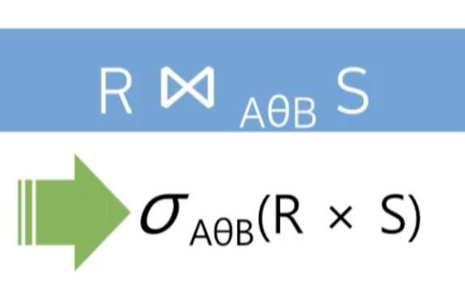
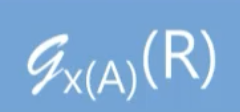
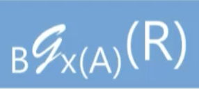
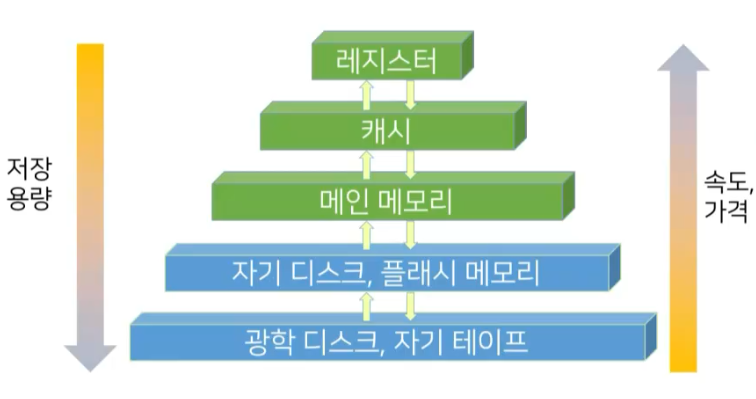

# 데이터베이스

- [데이터베이스](#데이터베이스)
  - [데이터베이스의 탄생](#데이터베이스의-탄생)
  - [데이터베이스 시스템의 특징](#데이터베이스-시스템의-특징)
  - [DBMS의 3단계 구조](#dbms의-3단계-구조)
  - [트랜잭션](#트랜잭션)
  - [데이터베이스 관련 용어 정리](#데이터베이스-관련-용어-정리)
  - [데이터베이스 언어](#데이터베이스-언어)
  - [데이터 정의 언어(DDL) : Data Definition Language](#데이터-정의-언어ddl--data-definition-language)
  - [데이터 조작 언어(DML) : Data Manipulation Language](#데이터-조작-언어dml--data-manipulation-language)
  - [데이터베이스 시스템 아키텍처](#데이터베이스-시스템-아키텍처)
  - [데이터베이스 모델링](#데이터베이스-모델링)
    - [데이터베이스 모델링의 필요](#데이터베이스-모델링의-필요)
    - [모델링의 단계](#모델링의-단계)
    - [데이터 모델](#데이터-모델)
    - [개념적 데이터 모델링](#개념적-데이터-모델링)
    - [논리적 데이터 모델링](#논리적-데이터-모델링)
    - [물리적 데이터 모델링](#물리적-데이터-모델링)
    - [사용자 요구사항](#사용자-요구사항)
    - [사용자 요구사항의 필요](#사용자-요구사항의-필요)
    - [사용자 요구사항 분석의 개념](#사용자-요구사항-분석의-개념)
    - [사용자 요구사항 분석 과정](#사용자-요구사항-분석-과정)
  - [ER 모델](#er-모델)
    - [개체 집합](#개체-집합)
    - [관계 집합](#관계-집합)
    - [속성](#속성)
    - [속성의 종류](#속성의-종류)
  - [제약조건](#제약조건)
    - [사상수(mapping cardinality)](#사상수mapping-cardinality)
    - [참가 제약조건(participation constraints)](#참가-제약조건participation-constraints)
    - [키(key) 속성](#키key-속성)
    - [특수 속성과 특수 관계](#특수-속성과-특수-관계)
  - [논리적 데이터 모델링 단계](#논리적-데이터-모델링-단계)
    - [릴레이션의 구성](#릴레이션의-구성)
    - [릴레이션의 특징](#릴레이션의-특징)
    - [키(key)의 역할](#키key의-역할)
    - [관계형 모델의 제약조건](#관계형-모델의-제약조건)
    - [널(NULL)의 개념](#널null의-개념)
  - [논리적 데이터 모델링](#논리적-데이터-모델링-1)
  - [관계 연산](#관계-연산)
    - [SELECT 연산](#select-연산)
    - [PROJECT 연산](#project-연산)
    - [집합 연산자](#집합-연산자)
    - [카티시언 프로덕트 연산](#카티시언-프로덕트-연산)
    - [조인 연산](#조인-연산)
    - [집계 함수 연산](#집계-함수-연산)
  - [SQL(Structured Query Language)](#sqlstructured-query-language)
    - [SQL의 구성](#sql의-구성)
    - [데이터 정의 언어(DDL : Data Definition Language)](#데이터-정의-언어ddl--data-definition-language-1)
    - [스키마 정의](#스키마-정의)
    - [데이터 타입의 개념](#데이터-타입의-개념)
    - [정수 데이터 타입](#정수-데이터-타입)
    - [실수 데이터 타입](#실수-데이터-타입)
    - [날짜 및 시간 데이터 타입](#날짜-및-시간-데이터-타입)
    - [문자 데이터 타입](#문자-데이터-타입)
    - [제약 조건](#제약-조건)
    - [SAFE UPDATES 모드](#safe-updates-모드)
    - [SELECT](#select)
    - [특수연산자](#특수연산자)
    - [함수](#함수)
    - [숫자함수](#숫자함수)
    - [문자함수](#문자함수)
    - [날짜함수](#날짜함수)
    - [집계함수](#집계함수)
    - [자연 조인](#자연-조인)
  - [뷰](#뷰)
    - [뷰 주의점](#뷰-주의점)
  - [정규화](#정규화)
    - [정규형](#정규형)
    - [제1정규형](#제1정규형)
    - [제2정규형](#제2정규형)
    - [제3정규형](#제3정규형)
    - [BC정규형](#bc정규형)
  - [역정규화](#역정규화)
  - [물리적 저장장치](#물리적-저장장치)
    - [휘발성/비휘발성](#휘발성비휘발성)
  - [데이터베이스 구성 요소](#데이터베이스-구성-요소)
    - [고정 길이 레코드](#고정-길이-레코드)
    - [고정 길이 레코드의 저장 방식](#고정-길이-레코드의-저장-방식)
    - [고정 길이 레코드의 삭제](#고정-길이-레코드의-삭제)
    - [가변 길이 레코드](#가변-길이-레코드)
    - [슬롯페이지 구조](#슬롯페이지-구조)
  - [파일 구조화 방법](#파일-구조화-방법)
    - [순차 파일 구조](#순차-파일-구조)
    - [오버플로우 블럭](#오버플로우-블럭)
  - [저장장치 접근](#저장장치-접근)
    - [버퍼 관리자](#버퍼-관리자)
    - [고정 블럭과 블럭 강제 출력](#고정-블럭과-블럭-강제-출력)
  - [인덱스](#인덱스)
    - [인덱스의 종류](#인덱스의-종류)
    - [인덱스 엔트리의 구조](#인덱스-엔트리의-구조)
    - [순서 인덱스](#순서-인덱스)
    - [B+트리 인덱스](#b트리-인덱스)
  - [해시(hash)](#해시hash)
    - [충돌과 동거자](#충돌과-동거자)
    - [정적 해싱](#정적-해싱)
    - [동적 해싱](#동적-해싱)
    - [확장성 해싱](#확장성-해싱)

## 데이터베이스의 탄생

과거에 데이터를 관리하는 방식으로 사용하던 파일 처리 시스템은 다음과 같은 문제가 있었다.
이를 해결하기 위해 데이터베이스가 탄생했다.

- 데이터 종속의 문제
  - 물리적 데이터 종속 : 저장된 데이터가 특정 H/W에서 또는 사용자 및 S/W만 사용될 수 있도록 제한된 문제
  - -> 신규 디스크 확장이 어렵다
  - 논리적 데이터 종속 : 데이터의 논리적 구조가 조금만 바뀌더라도 애플리케이션을 수정해야하고, 배포하는데 비용이 듬.
- 데이터 중복의 문제
  - 동일한 사항에 대한 중복 데이터는 일관성, 보안성, 경제성 측면에서 문제 발생
  - 파일 시스템은 연결 정보가 포함되지 않기 때문에 데이터의 중복이 생길 수 있다.
    - 일관성 : 한 사실에 대해 한 개의 데이터 값을 유지
    - 보안성 : 같은 데이터에 같은 수준의 보안 유지
    - 경제성 : 데이터에 대해 최소한의 저장 공간 만을 점유
- 무결성 훼손의 문제
  - 실세계의 데이터는 데이터가 가능 범위(제약조건)를 포함
  - 하지만 파일처리시스템에서는 이러한 제약조건이 없기 때문에
  - 데이터 무결성이 훼손될 수 있다.
- 동시 접근의 문제
  - 동일 데이터에 다수 사용자의 접근 허용시 일관성과 데이터의 무결성이 훼손될 수 있다.

데이터베이스가 나오면서 기존 애플리케이션은 직접 디스크에 접근하는 게 아니라 데이터베이스에 접근해서 데이터를 저장, 조회한다.

## 데이터베이스 시스템의 특징

- 데이베이스 시스템의 자기 기술성
  - 데이터와 데이터의 정의 및 설명(메타데이터)을 포함
- 프로그램과 데이터의 격리 및 추상화
  - 사용자에게 데이터에 대한 개념적인 표현을 재공하여 접근성을 향상
- 다중 뷰 제공
  - 각 사용자가 관심을 같는 데이터베이스의 일부만을 표현할 수 있는 기능 제공
- 데이터 공유와 다수 사용자 트랜잭션 처리
  - 다수의 데이터 조작 요청을 동시성 제어 기능을 통해 데이터의 일관성을 보장하면서 작업을 수행

## DBMS의 3단계 구조



DBMS는 프로그램과 데이터를 격리시켜 추상화하고, 다중 뷰를 제공하기 위해서 위와같은 3단계 구조로 만들어진다.

- 내부 단계 : 물리적인 표현(어떤 데이터가 어떤 디스크에 어떤 용량으로 저장되어있는지)
- 개념 단계 : 전체적인 데이터의 규모 또는 구조(데이터에 대한 설명)
- 외부 단계 : 실제 사용자가 데이터를 보게되는 뷰(일반 사용자는 외부 단계만 이용가능)

## 트랜잭션

- 하나의 논리적 작업을 처리하기 위한 일련의 데이터베이스 명령의 집합
- 데이터에 동시 접근 시 발생하는 일관성과 데이터의 무결성 훼손을 막기 위해
- 해당 데이터에 접근하는 사용자가 있다면 잠금(lock)을 이용해 접근을 막음

## 데이터베이스 관련 용어 정리

- 데이터(data) : 어떠한 사실에 대한 정량적, 정성적 특징을 나타낼 수 있는 값과 값에 대한 설명
- 데이터베이스(database) : 특정 기관의 애플리케이션 시스템에서 사용되는 데이터의 집합
- 데이터베이스 관리 시스템(DBMS) : 데이터베이스에 저장된 데이터의 구성, 저장, 관리, 사용을 위한 소프트웨어 패키지
- 데이터베이스 시스템(database system) : 정보를 데이터베이스에 저장, 관리하여 사용자에게 요구된 형태의 정보로 제공하는 컴퓨터 기반 시스템

## 데이터베이스 언어

- DBMS는 사용자가 데이터베이스를 쉽게 사용하고 다룰 수 있도록 언어 형태의 인터패이스를 제공
- 역할에 따라 다음과 같은 종류의 언어로 구분됨
  - 데이터 정의 언어(DDL)
  - 데이터 조작 언어(DML)
- 현대 데이터베이스 언어는 자연어와 유사한 형태의 SQL로 표준화

## 데이터 정의 언어(DDL) : Data Definition Language

- 데이터베이스 객체를 생성, 수정, 삭제하기 위한 언어
- DDL의 요구 기능
  - 데이터 모델에 따라 애플리케이션 프로그램이 요구하는 데이터의 논리적 구성이나 특징을 규정
  - 데이터가 기억장치에 저장되도록 데이터의 물리적 구성을 규정
  - 물리적 구성을 논리적 구성으로 변환이 가능하도록 데이터의 물리적 구성과 논리적 구성 간의 사상을 규정

## 데이터 조작 언어(DML) : Data Manipulation Language

- 구조화된 데이터에 사용자가 접근 및 조작할 수 있도록 지원하는 언어(검색, 삽입, 삭제, 수정)
- DML의 요구 조건
  - 데이터 조작이 쉽고 간편
  - 데이터 조작 기능이 정확하고 완전
  - 사용자의 요청을 시스템 내부에서 효율적으로 처리 가능

## 데이터베이스 시스템 아키텍처

1. 중앙집중식 방식
   - 단일 서버가 다수의 클라이언트 장치를 대신하여 작동
   - 중앙 컴퓨터의 과부하로 전체적인 성능 저하
2. 분산 시스템 방식
   - 클라이언트 장치의 성능 향상으로 자체적인 처리 능력 보유
   - 클라이언트-서버 데이터베이스 시스템
      - 애플리케이션 프로그램의 부하를 분산
      - 소프트웨어의 유자보수 비용을 절감 및 이식성 증가

## 데이터베이스 모델링

- 데이터의 의미를 파악하고 데이터와 관여하는 업무 프로세스를 개념적으로 정의하고 분석하는 작업

### 데이터베이스 모델링의 필요

- 비즈니스적 관점
  - 어떤 데이터를 저장해야 하는가?
- 컴퓨터 프로그래머 관점
  - 어떻게 데이터를 저장해야 하는가?

### 모델링의 단계

모델링의 단계는 다음과 같다

1. 사용자 요구사항 분석
2. 개념적 데이터 모델링 (데이터 및 업무)
3. 논리적 데이터 모델링 (ER 모델)
4. 물리적 데이터 모델링 (관계형 모델)
5. 내부 스키마 (물리적 세부사항)

### 데이터 모델

- 사용할 데이터를 선별하여 데이터베이스에 체계적으로 구조화하여 저장, 사용할 방법이 필요
- `데이터 모델` : 의미, 데이터 타입, 연산 등을 명시하기 위해 사용할 수 있는 개념들의 집합
- `데이터 모델링` : 실세계의 일부분을 DBMS가 지원하는 데이터 모델의 형태로 나타내는 과정

### 개념적 데이터 모델링

- 요구사항의 해석 오류를 방지
- 실세계의 데이터를 개념적으로 일반화시켜 데이터 구조, 데이터 타입, 속성, 관계, 제약조건 등을 이끌어내는 과정

### 논리적 데이터 모델링

- 특정 DBMS의 구현 모델에 맞춰 데이터를 표현하는 과정
- 데이터 정의 언어로 기술된 개념 스키마 생성

### 물리적 데이터 모델링

- 데이터베이스 파일의 내부 저장구조, 파일 구성, 인덱스, 접근 경로 등을 결정하는 과정

### 사용자 요구사항

### 사용자 요구사항의 필요

- 데이터에 대한 충분한 사전 분석없이 적절한 설계가 불가능
  - 데이터베이스의 구조가 점차 복잡해지고 수명 주기가 단축되고 때문에 신속, 정확성이 요구
  - 데이터베이스의 활용 범위가 확대됨에 데이터베이스의 효율적 운용에 초점
- 사용자의 요구를 명세하지 않고 데이터베이스 설계 및 개발을 진행하는 경우
  - 결과물의 `완성도 저하 및 신뢰도 추락`
  - 개발 후, 발생하는 에러 수정에 많은 `추가 비용 지출`

### 사용자 요구사항 분석의 개념

- 시스템의 대상이 되는 업무를 분석
  - 정보 시스템의 데이터베이스가 신속하고 효과적으로 업무 처리를 지원
  - 필요한 데이터를 저장 및 운용할 수 있는 구조 개발
- 도출, 분석, 기록 단게로 수행

### 사용자 요구사항 분석 과정

- 제안 요청서 -> 요구사항 도출
  - 구축대상, 프로젝트 목표, 범위를 기준으로 조사범위를 결정
  - 업무관계자 인터뷰
  - 외부자료 수집 및 분석
- 요구사항 명세서 -> 요구사항 분석
  - 도출된 요구사항의 명확성, 완전성, 모호성 검증
  - 불완전한 부분이 존재할 경우 요구사항 도출단계 재수행
  - 요구사항을 분류하여 통합 또는 분리
- 요구사항 정의서 -> 요구사항 기록
  - 요구사항 목록 정리 및 관리자의 승인
  - 정리된 요구사항을 형식에 맞춰 문서화

## ER 모델

- ER 모델은 개념적 모델링 과정에서 사용된다
- 실세계의 속성들로 이루어진 개체(entity)와 개체 사이의 관계(relationship)를 정형화시킨 모델
- 개념적 모델링 단계에서 사용되는 데이터 모델
- 데이터 구조와 관계를 ER 다이어그램(ERD)으로 표현
- 구성요소
  - 개체 집합
  - 관계 집합
  - 속성

### 개체 집합

- 개체(entity)
  - 실세계에 존재하는 다른 객체와 구별되는 유무형의 사물
  - 개체를 설명하는 여러 속성들로 구성
  - ex) 학생개체 (20192635, 김한수, 남, 20)
- 개체 집합(entity set)
  - 같은 속성을 공유하는 개체들의 모임
  - ex) 학생개체집합 (학생 개체는 다음과 같은 속성을 보유 : 학번, 이름, 성별, 나이)

### 관계 집합

- 관계
  - 개체와 개체 사이의 연관성
  - ex) 전공 관게 집합 : 학생번호가 20192635인 `학생`의 `전공`은 컴퓨터공학과이다
- 관계 집합
  - 개체 집합 간의 연결 관계
  - 마름모를 이용해 표현

### 속성

- 개체를 구체적으로 설명
- 속성에 포함될 수 있는 값의 특성에 따라 여러 종류로 구분
- 속성의 종류
  - 단순 속성과 복합 속성
  - 단일값 속성과 다중갑 속성
  - 유도 속성과 저장 속성

### 속성의 종류

- 단순 속성
  - 더 작은 구성요소로 나눌 수 없는 속성
  - ex) 성별, 나이 등
  - 학생이름, 생년월일은 더 작은 구성요소(성, 이름, 년, 월, 일)로 나눌 수 있으므로 단순 속성이 아니라고 볼 수 있음
- 복합 속성
  - 더 작은 구성요소로 나눌 수 있는 속성
  - 하위 속성은 들여쓰기로 표현
- 단일값 속성
  - 한 개체에 대해 단 하나의 값만을 갖는 속성
  - 전화번호는 여러 번호를 가질 수 있음(다중값 속성)
- 다중값 속성
  - 한 개체에 대해 여러 개의 값을 갖는 속성
  - {전화번호}처럼 중괄호를 이용해 표현
- 유도 속성
  - 다른 속성의 값으로 값이 유추될 수 있는 속성(실제 저장하지 않아도 됨)
  - ex) 나이는 생년월일을 기반으로 유추할 수 있음
  - 나이()로 표현
- 저장 속성
  - 유도 속성을 위해 사용될 수 있는 속성(실제 저장해야함)

## 제약조건

- 데이터 모델은 데이터, 의미, 구조, 연관성 및 데이터의 조건을 표현하기 위한 도구
- ER 모델은 개체와 관계에 대한 표현의 정확성을 위해 데이터가 준수해야 하는 제약조건을 정의할 수 있는 표현 방법을 제공
- 제약조건(constraints)의 종류
  - 사상수
  - 참가 제약조건
  - 키 속성

### 사상수(mapping cardinality)

- 관계 집합에 참가한 개체 집합에 대해 한 개체가 다른 개체와 관계를 맺을 수 있는 수량을 명시
- ex) 일대일(1 : 1), 일대다(1 : N), 다대다(N : M)
- 다수는 직선 단수는 화살표로 표현

### 참가 제약조건(participation constraints)

- 전체적 참가 : 어떤 개체 집합의 모든 개체가 관계 집합에 참여하는 조건
- 부분적 참가 : 어떤 개체 집합의 일부 개체가 관계 집합에 참여하는 조건
- '어떤 학생은 하나 이상의 수강을 할 수 있다'와 같은 제약조건을 표현

### 키(key) 속성

- 각 개체를 구별하는데 사용되는 유일한 값을 가지는 속성의 집합
  - 개체를 고유하게 구분하는 역할
  - 관계 집합의 특정 관계를 찾는 역할
- 밑줄로 표현

### 특수 속성과 특수 관계

- `관계 집합의 속성` : 두 개체 집합의 관계에서 생성되는 값을 저장하는 속성
- `재귀적 관계` : 한 개체 집합이 자기 자신과 관계 집합을 형성하는 관계
- `약한 개체 집합`
  - 개체의 존재 유무가 관계를 맺고 있는 개체의 존재에 종속되는 개체 집합
- `강한 개체 집합`
  - 약한 개체 집합과 연결되는 일반 개체 집합
  - 관계 집합을 이중선으로 표시함

## 논리적 데이터 모델링 단계

- DBMS에서 사용하는 데이터 모델에 맞추어 데이터를 표현하는 과정
- 데이터 정의 언어로 기술된 개념 스키마 생성
- 관계형 모델(relational model)
  - 릴레이션(relation)으로 데이터를 표현하는 모델
  - 데이터 표현이 단순하고 직관적 구조화 모델
  - 현재 대다수 DBMS의 기초
    - 관계형 모델을 사용하는 관계형 DBMS(RDBMS)
    - Oracle, DB2 PostgreSQL, MySQL, MSSQL 등

### 릴레이션의 구성



- 릴레이션
- 컬럼, 속성, 필드
- 스키마
- 레코드, 투플
- 컬럼값
- 인스턴스

### 릴레이션의 특징

- 레코드의 유일성 : 중복된 레코드 존재 불가능
- 레코드의 무순서성 : 레코드의 순서는 의미가 없음
- 컬럼의 무순서성 : 컬럼의 순서가 없고 이름과 값의 쌍
- 컬럼값의 원자성 : 모든 값들은 나눌 수 없는 단 하나의 의미

### 키(key)의 역할

- 릴레이션의 레코드를 유일하게 식별하는 값
- 키의 속성
  - 유일성(uniquenesss) : 유일한 값
  - 최소성(irreducibility) : 속성 하나를 제거하면 유일하게 식별할 수 없도록 최소의 속성으로 구성
- 종류
  - 수퍼키(super key): 유일성 만족
  - 후보키(candidate key): 유일성, 최소성 만족
  - 기본키(PK: primary key): 레코드의 구분을 위해 선택된 후보키
  - 외래키(FK: foreign key): 참조된 다른 릴레이션의 기본키(레코드 간 연관성을 표현)

### 관계형 모델의 제약조건

- `영역 제약조건` : 컬럼에 정의된 영역(domain)에 속한 값으롬나 컬럼값이 결정
- `키 제약조건` : 키는 레코드를 유일하게 구별하는 값으로 구성
- `개체 무결성 제약조건` : 어떠한 기본키 값도 널(null)이 될 수 없음
- `참조 무결성 제약조건` : 반드시 존재하는 레코드의 기본키만 참조 가능

### 널(NULL)의 개념

- `없음` 또는 `0`이 아닌 미지의 값에 대한 표현
- 입력된 적이 없는 값
- 적용 불가능한 값

## 논리적 데이터 모델링

- DBMS의 구현 모델에 맞춰 데이터를 표현하는 과정
- 데이터 정의 언어로 기술된 개념 스키마 생성
- 논리적 데이터 모델링의 필요
  - 관계형 DBMS(RDBMS)의 구현 모델에 맞춰 데이터의 구조와 관계를 표현
  - 작성된 ERD를 RDBMS가 수용 가능하는 구조로 변경

## 관계 연산

- 관계형 모델을 기반으로 구성된 릴레이션을 사용하여 새로운 릴레이션을 생성하는 표현
- 사용자의 관점에서 필요한 데이터를 릴레이션에서 추출하는 방법을 제공하는 도구
- 관계 대수(relational algebra)
  - 관계 연산을 정의하는 방법
  - 주어진 릴레이션에서 필요한 릴레이션을 만드는 연산자로 구성
  - 관계 대수 연산자는 새로운 임시 릴레이션을 생성
  - 연산자를 중첩하여 연산 처리 절차를 표현

### SELECT 연산


- 주어진 릴레이션에서 조건을 만족하는 레코드를 갖는 릴레이션을 생성
- SELECT 연산의 기호는 그리스 문자 시그마(σ)
- 표기 형식 : σ(조건)(R)
- ex) `σ소속학과='컴퓨터공학과'∧연봉≥50000000(교수)`

### PROJECT 연산



- 기술된 컬럼만 갖는 릴레이션으로 재구성
- 컬럼을 ,(콤마)로 분리하여 기술
- ex) π교수이름,소속학과(교수)ㄴ

### 집합 연산자

- 수학적 집합 이론에서의 이진 연산
  - 합집합 : R ∪ S
  - 교집합 : R ∩ S
  - 차집합 : R - S
- 릴레이션은 집합, 레코드는 집합에 포함된 원소
- 집합 연산자 사용 조건
- 릴레이션 R과 S의 차수가 동일
- 모든 i에 대해 R의 i번째 컬럼의 도메인과 S의 i번째 컬럼의 도메인이 반드시 동일

### 카티시언 프로덕트 연산



- 두 릴레이션에 포함된 레코드 간의 모든 집합을 생성하는 이항 연산자
- R X S
- 조건에 상관 없이 R과 S의 가능한 모든 조합을 생성한다

### 조인 연산



- 두 릴레이션에서 조건을 만족하는 레코드를 결합한 레코드로 구성된 릴레이션을 생성

### 집계 함수 연산



- 집계 함수를 값들의 집합 또는 레코드의 집합에 적용하는 연산
- AVG, SUM, MIN, MAX, COUNT 등의 집계함수
- A: 집계 연산을 적용할 컬럼

레코드 그룹화를 위해 집계 함수 연산자 앞에 그룹화도 가능



- 레코드 그룹화를 위해 집계 함수 연산자 앞에 그룹화 속성을 기술
- B : 그룹의 기준이 되는 컬럼
- x() : 집계 함수
- A : 집계 연산을 적용할 컬럼
- R : 릴레이션

## SQL(Structured Query Language)

- 관계대수에 기초하여 RDBMS의 데이터 관리를 위해 설계된 언어
- 비절차적(선언형) 언어, 필요한 데이터만 기술
- 인간의 언어와 매우 유사하고 간단, 명료

### SQL의 구성

- `데이터 정의 언어`(DDL: Data Definition Language)
  - 데이터베이스 내의 객체를 생성 및 삭제하고 그 구조를 조작하는 명령어의 집합
  - 데이터가 준수해야 하는 `제약조건`을 기술
  - `CREATE`, `ALTER`, `DROP` 등
- `데이터 조작 언어`(DML : Data Manipulation Language)
  - DDL에 의해 정의된 테이블에 데이터를 조작하는 명령어의 집합
  - 데이터에 대한 CRUD(생성, 검색, 삭제, 수정) 명령을 포함
  - `INSERT`, `UPDATE`, `DELETE`, `SELECT` 등

### 데이터 정의 언어(DDL : Data Definition Language)

- 데이터베이스 객체를 생성, 삭제 또는 구조를 수정하는 명령어의 집합
- 데이터베이스 객체의 종류
  - 데이터 저장 : 테이블, 인덱스, 뷰
  - 데이터 조작 : 트리거, 프로시저, 함수 등
- DDL의 종류
  - CREATE : 객체 생성
  - ALTER : 객체 수정
  - DROP : 객체 삭제

### 스키마 정의

- 데이터베이스와 동일한 개념 (스키마 = 데이터베이스)
- 한 조직의 데이터베이스 시스템의 운영에 필요한 테이블, 인덱스, 뷰 등의 데이터베이스 객체의 집합
- 스키마 관리 방법
  - Forward Engineer
  - SQL 에디터
  - 네비게이터 패널
- 변경 기능을 제공하지 않음 : 일반적으로 변경을 원할 시에 삭제 후 재생성하도록 함 -> ALTER SCHEMA를 제공하지 않음

### 데이터 타입의 개념

- 컬럼이 가질 수 있는 값의 범위, 즉 도메인을 결정
- 프로그래밍 언어에서의 변수를 생성하는 데이터 타입의 사용목적과 방법이 매우 유사
- 기본 데이터 타입
  - 문자 : CHAR(n), VARCHAR(n), TEXT, ...
  - 숫자 : INT, FLOAT, DOUBLE, DECIMAL(m,n), ...
  - 날짜/시간 : DATE, TIME, DATETIME, TIMESTAMP, ...

### 정수 데이터 타입

- `TINYINT` - 1바이트 정수, -128~127
- `SMALLINT` - 2바이트 정수, -32768~32767
- `INT` - 4바이트 정수, 약 -20억~20억
- `BIGINT` - 8바이트 정수

### 실수 데이터 타입

- 고정 소수형
  - `DECIMAL(m,n)` - 전체 m자리, 소수점 이하 n자리의 숫자
  - `NUMERIC` - DECIMAL과 동일
- 부동 소수형
  - `FLOAT` - 4바이트 크기 부동 소수
  - `FLOAT(P)` - 소수점 이하 P개 자리의 부동 소수
  - `DOUBLE` - 8바이트 크기 부동 소수

### 날짜 및 시간 데이터 타입

- 날짜 데이터 타입
  - `DATE` - 'YYYY-MM-DD' 형식의 시간
  - `YEAR` - 'YYYY' 형식의 연도
- 시간 데이터 타입
  - `TIME` - 'HH:MI:SS'형식의 시간
- 날짜 및 시간 데이터 타입
  - `DATETIME` - 'YYYY-MM-DD HH:MI:SS'형식의 날짜 및 시간
  - `TIMESTAMP` - 기능적으로 DATETIME과 유사

### 문자 데이터 타입

- `CHAR(n)` - 최대 길이가 n인 고정길이 문자열
- `VARCHAR(n)` - 최대 길이가 n인 가변길이 문자열
- 각 타입은 데이터 저장 공간을 확보하는 것에 차이가 있기 때문에 주의해야함
- VARCHAR는 가변적으로 저장공간을 변경하기 때문에 DBMS입장에서 어떤 컬럼의 데이터의 크기가 일정하지 않다면, 관리가 힘들 수 있음
- VARCHAR는 데이터 변경 시에 저장공간의 변경으로 인해 부수효과(오버헤드)가 발생할 수 있다
- `TEXT, CLOB` - 길이가 최대 2~4GB인 가변길이 문자열
- `ENUM` - 유한개의 문자열 집합 중 하나의 값을 선택

### 제약 조건

- 테이블과 테이블에 존재하는 데이터의 무결성을 유지하기 위한 목적으로 사용
- 제약 조건에 어긋나는 데이터는 저장할 수 없게 구조적으로 조정함
- `PRIMARY KEY` : 기본키 지정, UNIQUE, NOT NULL
- `FOREIGN KEY` : 외래키 지정, 참조 컬럼 정의
- `NOT NULL` : NULL을 허용하지 않는 컬럼 지정
- `UNIQUE` : 동일한 컬럼값을 가질 수 없음
- `AUTO_INCREMENT` : 레코드가 추가될 때 자동으로 속성값이 1부터 1씩 증가되어 입력됨
- `CHECK` : 컬럼값에 특정 조건 준수 여부를 지정

### SAFE UPDATES 모드

- UPDATE, DELETE 문에 WHERE 문이 없다면 실행 여부를 다시 한 번 확인하도록 하는 안전핀 역할
- MySQL은 SAFE UPDATES 모드를 지원함
- 기본키가 아닌 컬럼을 대상으로 수정/삭제 시 부작용이 발생할 수 있어 실행 여부를 결정하도록 함
- `SET SQL_SAFE_UPDATES = 1 # enable safe mode`

### SELECT

- 관계 대수의 셀력션, 프로젝션, 조인, 카티션 프로덕트 연산자의 기능을 모두 포함하는 명령문

``` SQL
SELECT [DISTINCT] 컬럼...
  FROM 테이블1 [INNER JOIN|OUTER JOIN] 
       테이블2 
       ON 조인 조건
  [ON 조인 조건식]
  [WHERE 조건식]
  [GROUP BY 컬럼...]
    [HAVING (GROUP BY 조건)...]
  [ORDER BY 컬럼 [ASC|DESC]]
```

### 특수연산자

- 범위 포함 여부, 부분 일치 여부, 포함 여부 등의 연산
- `BETWEEN V1 AND V2` : V1~V2 사이에 존재하는 값 검사 (= `WHERE value >= V1 AND value <= V2`)
- `LIKE` : 부분적으로 일치하는지 검사
  - `컬럼명 LIKE '%V1%` -> V1을 포함하는 문자열 검사
  - `컬럼명 LIKE 'A_'` -> A로 시작하는 두글자 문자 검사 (_로 자리수 고정)
  - `컬럼명 LIKE '[A-C]'` -> A~C인 문자열 검사
- `IN (V1, V2)` : V1, V2 안에 포함되는지 검사

### 함수

- 특정 목적을 수행하도록 사전에 정의된 연산 및 기능을 수행한 후 결과값을 반환하는 명령어 집합
- SQL에서도 함수가 존재함
- MySQL 함수 종류
  - 문자함수
  - 숫자함수
  - 날짜 및 시간함수

### 숫자함수

- 삼각함수, 상수, 올림과 버림, 난수 등의 숫자 데이터 타입에 적용할 수 있는 계산을 위한 함수
- ABS(x) : 절대값
- SIN(x), COS(x), SIN(x) : 삼각함수
- CEILING(x) : x 보다 크지 않은 최소 정수
- FLOOR(x) : x 보다 작지 않은 최대 정수
- LN(x) : 자연로그 lnX의 값 반환
- PI() : 원주율 값을 반환
- POWER(x, y) : x의 y제곱 값 반환
- RAND() : 0~1사이의 임의의 값 반환
- ROUND(x, y) : x의 y번째 소수점 기준으로 반올림한 값을 반환
- SQRT(x) : x의 제곱근의 값을 반환
- TRUNCATE(x, y) : x의 y번째 소수점 이하를 버림한 값을 반환

### 문자함수

- 문자열 조작에 관련된 함수
- CHAR_LENGTH(x) : x의 글자수 반환
- CONCAT(x, y) : x와 y문자열을 결합
- LOWER(x) : x의 문자를 모두 소문자로 변환
- UPPER(x) : x의 문자를 모두 대문자로 변환
- SUBSTRING(x, a, b) : x의 a번째 문자부터 b개의 문자열을 반환
- TRIM(x) : x의 양쪽 공백 문자 제거한 값을 반환
- LTRIM(x) : x의 왼쪽 공백 문자 제거한 값을 반환
- RTRIM(x) : x의 오른쪽 공백 문자 제거한 값을 반환

### 날짜함수

- 날짜 및 시간에 관련된 함수
- ADDDATE(x, INTERVAL y 단위) : x에 y 단위의 시간을 더한 날짜를 반환
- ADDTIME(x, y) : x와 y 시각을 더한 날짜를 반환
- CURDATE(), CURRENT_DATE() : 현재 날짜를 반환
- CURTIME(), CURRENT_TIME() : 현재 시간을 반환
- DATE(x) : x에서 날짜(년,월,일)을 반환
- YEAR(x) : x에서 연도 값을 반환

### 집계함수

- COUNT(컬럼명) : 컬럼에 있는 값들의 개수
- SUM(컬럼명) : 컬럼에 있는 값들의 합
- AVG(컬럼명) : 컬럼에 있는 값들의 평균
- MAX(컬럼명) : 컬럼에서 가장 큰 값
- MIN(컬럼명) : 컬럼에서 갖아 작은 값

### 자연 조인

- 동일한 이름의 칼럼에 대해 값이 같은 레코드를 결합하는 내부 조인
- JOIN 조건이 존재하지 않고 자동으로 조인 조건을 결정

``` SQL
SELECT 컬럼,,,
FROM 테이블1 NATURAL JOIN 테이블2
[WHERE 조건]
```

## 뷰

- 데이터를 저장하고 있는 하나 이상의 테이블을 유도하여 생성하는 가상의 테이블(virtual table)
  - `데이터 독립성` : 원본 테이블의 구조가 바뀌어도 뷰를 이용한 작업은 정의만 변경되어 응용 프로그램에 영향이 없음
  - `데이터 보안` : 사용자에게 원본 테이블의 일부 컬럼에 대한 접근을 허용하여 보안 효과를 향상
  - `다양한 구조의 테이블 사용` : 사용자의 요구사항에 맞는 테이블의 구조를 제공
  - `작업의 단순화` : 복잡한 질의문을 뷰로 단순화
  - `데이터 무결성` : WITH CHECK OPTION을 이용하여 뷰 생성에 위배되는 수정작업을 거부

### 뷰 주의점

- 뷰에 대한 INSERT 문은 원본 테이블에서 실행
  - PRIMARY KEY 등 제약조건이 위배되는 경우 INSERT 불가능
  - 원본 테이블에 존재하지만, 뷰에는 없는 컬럼에 INSERT하는 경우 불가능
  - 조인 질의 또는 그룹 질의가 적용된 뷰는 INSERT, 수정 불가능
  - WITH CHECK OPTION이 적용된 뷰는 위배되는 사항은 없지만 뷰에 맞지 않는 조건일 경우 실행 불가능

## 정규화

- 특정 정규형의 조건을 만족하도록 릴레이션과 속성을 재구성하는 과정
- 데이터베이스 내에 모든 릴레이션을 효과적으로 표현하고
- 보다 간닪나 관계연산에 기초하여 검색 알고리즘을 효과적으로 작성할 수 있게 함
- 바람직하지 않은 삽입, 수정, 삭제 등의 이상 발생 방지
- 새로운 형태의 데이터가 삽입될 때 릴레이션 재구성의 필요성을 축소

### 정규형

- 이상 현상을 최소화 하도록 특정 조건을 갖춘 릴레이션의 형식
- 정규형의 분류 (제1정규형, 제2정규형, 제3정규형, BC정규형, 제4정규형, 제5정규형)
- 보통 제4정규형, 제5정규형은 사용하지 않음
- 이상현상이 발생할 가능성을 차단하기 위해 원칙을 기반으로 효과적으로 스키마를 모델링하는데 이용되는 기법

### 제1정규형

- 가장 조건이 단순한 정규형
- 관계형 모델에 조건에 따라 자동 적용되는 정규형
- 릴레이션 스키마에서 정의된 모든 속성의 도메인이 원자값을 갖는 상태

### 제2정규형

- 릴레이션이 제1정규형을 만족하고, 기본키의 부분집합이 특정 속성을 종속하고 있지 않은 상태
- (=주어진 릴레이션의 인스턴스가 기본키가 아닌 속성들이 완전히 종속되어 있는 상태)

### 제3정규형

- 릴레이션이 제2정규형을 만족하고, 기본키가 아닌 속성들이 어떤 키에도 이행적으로 종속되지 않는 상태
- `이행적 종속` : 종속관계가 중복되는 경우

``` js
// 종속관계는 다음과 같은 상태 (도크번호->담당도선사, 목적->담당도선사)
`도크번호`->`목적`
`도크번호`->`담당도선사`
`목적`->`담당도선사`
```

- 제2정규형~제3정규형은 릴레이션(테이블)을 분해하는 과정

### BC정규형

- 릴레이션이 제3정규형을 만족하고, 릴레이션에 성립하는 X->Y 형태의 모든 함수적 종속성에 대하여 X가 수퍼키인 상태
-> 함수형 종속성에서 X가 유일한 결정자

## 역정규화

- 정규화의 반대과정(정규화를 한 후에 앞으로 앞당기는 추가 작업 정규화를 하지 않는 게 아님!)
- 데이터 접근 성능 개선을 목적으로 한다
- 정규화는 릴레이션 분할을 통해 데이터의 중복성을 최소화하지만, 사용 과정에서 많은 조인 연산을 유발하고 이는 조회 연산 실행 시간 증가를 유발한다 이럴 때 어느 정도 역정규화가 필요하다.

## 물리적 저장장치

- 물리적 저장장치는 데이터 접근 속도, 용량을 기준으로 다양한 장치로 구성됨
- 다음 순서로 저장용량이 커지고, 속도와 가격은 내려감
- `레지스터` -> `캐시` -> `메인 메모리` -> `자기 디스크`, `플래시 메모리` -> `광학 디스크`, `자기 테이프`



### 휘발성/비휘발성

- `레지스터`, `캐시`, `메인 메모리`는 종료 시에 저장되어 있던 데이터가 사라지는 `휘발성`의 특성을 가진다
  - `캐시` : 고비용 저장장치로 빠른 접근 속도를 보장
  - `메인 메모리` : 실제 프로그램과 데이터 적재 공간
- `비휘발성`의 특성을 가지는 저장장치로는 위 저장장치를 제외한 `플래쉬 메모리`, `자기 디스크`, `광학 디스크 드라이브`, `테이프 장치`가 있다
  - 접근 속도는 느리지만, 저장공간을 대량으로 확보할 수 있음
  - `플래쉬 메모리`: 메인 메모리와 유사하나 비휘발성
  - `자기 디스크`: 데이터베이스 전체를 안정적으로 저장
  - `광학 디스크 드라이브`: CD, DVD, Blue-ray 등
  - `테이프 장치`: 용량이 크고 저렴하나 순차 접근 방식을 속도가 매우 느림

## 데이터베이스 구성 요소

- 파일
  - 데이터를 영구적으로 저장하기 위해 사용되는 가장 기초적인 논리적 구조
- 블럭
  - 파일을 고정적인 길이로 분할하여 생기는 균등한 크기의 데이터 묶음
  - 일반적으로 메모리와 디스크간 데이터 전송 단위로 결정
- 레코드
  - 블럭을 구성하는 요소
  - 더 이상 분리될 수 없는 최소 데이터 저장 단위

### 고정 길이 레코드

- 고정적인 바이트 수를 갖는 레코드를 저장
- 데이터 접근 시 모든 레코드의 크기가 균일하게 고정되어 있으니 i*(고정길이)의 메모리 위치를 조회한다
- ex) char(8), int, ...

### 고정 길이 레코드의 저장 방식

- 블럭 길이가 레코드 길이로 정확히 나눠지지 않으면, 잔여 공간을 비워두고 `다음 블럭`에 레코드를 저장하는 방법
  - 잔여 공간이 남으므로 자원을 낭비할 수 있음
  - 레코드 삭제 시 문제점 해당 레코드가 저장된 위치에 빈 공간이 생성(빈공간의)
- 블럭의 길이가 레코드 길이로 정확히 나눠지지 않아 한 레코드를 `두 블럭`에 나누어 저장
  - 두 블럭을 접근 시 오버헤드 증가

### 고정 길이 레코드의 삭제

- 고정 길이 레코드 삭제 시 문제점
  - 해당 레코드가 저장된 위치에 빈 공간이 생성
  - 장시간 레코드의 삽입 및 삭제 발생 시, 저장 공간에 많은 낭비가 발생
- 대처 방안
  - 마지막 레코드로 공백 대체(마지막 레코드를 가져와 삭제된 공백을 대체) -> 레코드의 순서가 입력된 순서와 다르게 변경되므로 문제가 발생할 수 있음
  - 삭제 레코드 이후의 남은 레코드를 모두 한 칸씩 이동(레코드 순서 맞추기) -> 모든 레코드를 한 칸씩 이동해야하는 오버헤드가 너무 큼
  - 가용 리스트 관리(공백 레코드 포인터를 이용해 공백에 대한 정보를 연결 리스트로 따로 저장하여 새로운 데이터 입력 시 빈 공간에 데이터를 쉽게 채움)

### 가변 길이 레코드

- 바이트 수가 가변적인 레코드를 저장
- 사용 케이스
  - 한 블럭 내에 저장되는 레코드 유형이 둘 이상
  - 길이가 고정되지 않은 컬럼의 개수가 하나 이상
  - 레코드가 멀티셋을 허용한 컬럼을 가질 때
  - `멀티셋`: 레코드의 컬럼값이 여러 개인 컬럼(보통의 RDBMS에선 허용되지 않는 특수한 경우)

### 슬롯페이지 구조

- 가변 길이 레코드를 저장하는 방법 중 하나
- `블럭 헤더`(레코드 요약 정보 보유: 레코드 개수, 레코드 포인터 등)
- 블럭 헤더는 메모리 가장 앞, 레코드는 메모리 가장 뒤에서부터 추가함
- 이는 고정된 메모리를 사용하기 위해서 고안된 구조임(운영체제 메모리 구조와 비슷)

## 파일 구조화 방법

- 파일 수준에서 레코드의 순서 등을 관리하는 기법
- 아래 중 `순차 파일 구조`가 가장 안정적이고 자주 사용됨
- `힙 파일 구조`: 저장 순서 고려없이 파일 내 임의의 위치에 배치(저장 속도가 빠름, 순서 없이 저장하므로 풀 스캔을 하기에 조회 효율은 떨어짐)
- `순차 파일 구조`: 레코드들이 탐색키 기준으로 정렬되어 저장(힙 파일 구조보다 저장 속도가 느림, 순서가 이미 정렬되어 있으므로 조회 속도는 빠름(이진 탐색 가능))
- `해시 파일 구조`: 해시 함수를 사용하여 블럭 주소 계산(해시 함수에 따라 성능이 결정됨)

### 순차 파일 구조

- 레코드가 검색키 순서대로 정렬
- 레코드가 파일에 삽입되는 시점에서 키 값이 부여됨
- 장점
  - 이미 정렬되어 있기 때문에 검색키에 대한 정렬 연산이 불필요. 키 값들의 순서로 레코드를 판독하는 연산에 효율적
  - 현재 레코드에서 정렬된 키 순서로 다음 레코드를 찾을 때 부가적인 블럭 접근이 불필요
  - 이진 탐색을 사용해 빠르게 레코드를 검색 가능
- 단점
  - 레코드 삽입, 삭제에 많은 비용 소요됨

### 오버플로우 블럭

- 순차 파일 구조에서 레코드의 정렬된 상태 유지를 위해 삽입된 신규 블럭
- 신규 블럭을 생성해서 포인터로 연결 -> 순서를 유지하기 위해 순차적으로 각 레코드를 이동시킬 필요가 없어 저장 성능이 향상됨

## 저장장치 접근

- `파일`: 논리적 관점에서의 저장 객체
- 실제 저장될 때에는 여러 개의 물리적 단위인 `블럭`으로 저장
  - `블럭`: 메모리와 디스크 간 데이터의 전송 단위
  - 일반적으로 2~32KB 사용
  - 블럭 전송을 최소화할수록 입출력 시간 단축
    - 사용 중인 블럭을 지속적으로 메모리에 적재
    - 한정적 공간으로 인해 필요에 따라 특정 블럭 할당 해지
    - 메모리 내부에 버퍼라는 공간에 블럭을 저장하고, 이를 관리하는 `버퍼 관리자` 사용

### 버퍼 관리자

- DBMS상의 소프트웨어는 필요한 블럭이 있을 때 `버퍼 관리자`에게 해당 블럭을 요청함
- `버퍼 관리자`
  - 요청된 블럭이 버퍼에 있다면, 버퍼 관리자는 블럭이 위치한 메모리 주소를 전달
  - 요청된 블럭이 없다면, 버퍼 내에 새로운 공간을 할당하고 해당 블럭을 적재
  - 더 이상 적재할 공간이 없다면, 기존 블럭을 선택하여 할당 해지 후 해당 블럭을 적재

- `버퍼 교체 전략`
  - 가용 공간을 확보하기 위해 기존에 적재된 블럭의 할당을 특정 기준에 의하여 해지
  - 미래에 가장 적게 사용될 블럭을 선택하여 디스크로 내보내는 것이 이상적
  - 버퍼 교체 전략 기법
    - LRU(Least Recently Used): 최근에 가장 적게 참조된 블럭을 교체
    - MFU(Most Frequently Used): 특정 기간동안 가장 여러번 사용된 블럭을 교체

### 고정 블럭과 블럭 강제 출력

- 경우에 따라 메모리에서 고정적으로 블럭을 들고 있어야하거나 바로 저장이 필요한 중요한 데이터를 메모리에서 블럭을 강제 출력(디스크 저장)이 필요하다
- 고정 블럭
  - 장애로 인한 메모리의 데이터가 손실되어 작업이 중단될 경우, 중단된 작업의 결과물이 디스크에 기록되는 것을방지
  - 디스크 블럭이 교체되는 것을 제한
- 블럭 강제 출력
  - 시스템 로그와 같이 중요한 데이터는 디스크에 영구적으로 기록되어야함
  - 버퍼 공간이 필요없어도 강제로 디스크에 기록

## 인덱스

- DBMS에서 요청된 레코드에 빠르게 접근할 수 있도록 지원하는 데이터와 관련된 부가적인 구조
- `인덱싱`: 인덱스를 구성하고 생성하는 작업
- `탐색키`: 파일에서 레코드를 찾는데 사용되는 컬럼이나 컬럼의 집합

### 인덱스의 종류

- `순서 인덱스`: 특정 값에 대해 정렬된 순서 구조
- `해시 인덱스`: 버킷의 범위 안에서 값의 균일한 분포에 기초한 구조. 해시 함수가 어떤 값이 어느 버킷에 할당되는지 결정
- 인덱스 평가 기준
  - `접근 시간`, `유지 비용`(데이터 삽입, 수정 삭제에 대한 구조 갱신 비용), `공간 비용`

### 인덱스 엔트리의 구조

- 탐색키 값, 포인터(블럭 ID, 오프셋(다음 바이트 주소 위치))로 구성되어 있음

### 순서 인덱스

- 탐색키를 정렬하여 해당 탐색키와 탐색키에 대한 레코드와의 연계를 통해 인덱스 생성
- 정렬되어 있기 때문에 이진탐색 등을 이용해 데이터 조회 시간에 이점이 있음
- 순서 인덱스 종류:
  - `밀집 인덱스`
    - 모든 레코드에 대해 탐색키 값/포인터 쌍을 유지
  - `희소 인덱스`
    - 인덱스 엔트리가 일부의 탐색키 값만을 유지
  - `다단계 인덱스`
    - 내부 인덱스와 외부 인덱스로 구성(희소 인덱스의 중첩)
    - 외부 인덱스를 내부 인덱스보다 희소한 인덱스로 구성(엔트리의 포인터가 내부 인덱스 블럭을 지칭)

### B+트리 인덱스

- 상용 DBMS에서 사용하는 대표적인 인덱스 자료구조
- 루트 노드로부터 모든 단말 노드에 이르는 경로 비용이 같은 높이 균형 트리
- 단말 노드가 서로 연결 리스트구조로 연결되어 있는 특징이 있음
- 각 노드 안에는 인덱스 엔트리가 포함됨

## 해시(hash)

- 탐색키에 산술적인 연산을 통해 버킷의 주소를 계산하는 해시 함수를 사용하여 데이터 배분 및 접근하는 기법
- `버킷`(bucket)
  - 한 개 이상의 레코드를 저장할 수 있는 저장공간의 단위
  - 크기는 일반적으로 디스크 블록의 크기와 일치

### 충돌과 동거자

- `충돌`: 서로 다른 두 레코드가 동일한 버킷에 대응
  - **오버플로**(overflow)
    - 버킷에 레코드를 저장할 수 있는 여유 공간이 없는 상황에 발생
    - 추가적인 버킷 할당 또는 다음 버킷에 할당하여 처리
    - 오버플로가 발생할수록 접근 시간이 길어지므로 성능 저하
- `동거자`: 충돌에 의해 같은 버킷 주소를 갖는 레코드

### 정적 해싱

- 버킷의 개수가 고정된 해싱 기법
- 문제점
  - 데이터베이스의 크기가 커짐에 따른 성능 감소
  - 미리 큰 공간을 잡을 경우 초기에 상당한 양의 공간이 낭비
  - 재구성 시 새롭게 선택된 해시 함수를 사용하여 모든 레코드에 대하여 다시 계산하고 버킷에 할당하는 대량의 비용 발생
  - 위 문제점으로 해시 구조의 크기가 동적으로 결정되는 `동적 해싱 기법`이 제안됨

### 동적 해싱

- 정의
  - 버킷의 개수를 가변적으로 조절할 수 있는 해싱 기법
  - 데이터베이스의 크기에 따라 버킷의 크기가 비례
- `확정성 해싱`
  - 동적 해싱의 일종으로 디렉터리와 버킷의 2단계 구조
  - `디렉터리`: 디스크에 저장되는 버킷 주소 테이블
  - 디렉터리 깊이를 의미하는 정수값 d를 포함하는 헤더와 데이터가 저장된 버킷에 대한 2^d개의 포인터로 구성

### 확장성 해싱

- 모조키 시작 비트 스트링으로 버킷의 위치를 구분
- `모조키`(pseudo key)
  - 레코드의 탐색키 값이 해시 함수에 의해 일정 길이의 비트 스트링으로 변환된 키
  - 모조키의 첫 d비트를 사용하여 디렉터리에 접근
- `버킷 헤더`
  - 정수값 i(<=d)가 저장되어 있음을 표시
  - i는 버킷에 저장되어 있는 레코드의 모조키들이 처음부터 i비트까지 일치함을 표기
