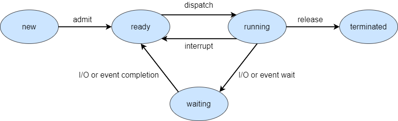

# 운영체제

- [운영체제](#운영체제)
  - [운영체제의 역할](#운영체제의-역할)
  - [CPU의 동작 모드](#cpu의-동작-모드)
  - [시스템 호출](#시스템-호출)
  - [커널](#커널)
    - [일체형 커널(monolithic kernel)](#일체형-커널monolithic-kernel)
    - [마이크로 커널](#마이크로-커널)
  - [운영체제의 구성](#운영체제의-구성)
    - [프로세스 관리자](#프로세스-관리자)
    - [메모리 관리자](#메모리-관리자)
    - [장치 관리자](#장치-관리자)
    - [파일 관리자](#파일-관리자)
  - [운영체제의 유형](#운영체제의-유형)
    - [일괄처리(batch processing) 운영체제](#일괄처리batch-processing-운영체제)
    - [대화형(interactive) 운영체제](#대화형interactive-운영체제)
    - [실시간(real-time) 운영체제](#실시간real-time-운영체제)
    - [하이브리드(hyrid) 운영체제](#하이브리드hyrid-운영체제)
  - [프로세스(process)](#프로세스process)
  - [프로세스 운영자의 역할](#프로세스-운영자의-역할)
  - [프로세스의 상태](#프로세스의-상태)
    - [프로세스 5-상태 모델](#프로세스-5-상태-모델)
  - [프로세스 제어 블록(PCB)](#프로세스-제어-블록pcb)
  - [프로세스 생성과 종료](#프로세스-생성과-종료)
    - [프로세스 생성](#프로세스-생성)
    - [프로세스 생성 시스템 호출](#프로세스-생성-시스템-호출)
    - [생성되는 프로세스의 자원](#생성되는-프로세스의-자원)
    - [프로세스 종료](#프로세스-종료)
    - [프로세스 종료 시스템 호출](#프로세스-종료-시스템-호출)
  - [프로세스 간의 관계](#프로세스-간의-관계)
  - [전통적인 프로세스](#전통적인-프로세스)
  - [쓰레드(Thread)](#쓰레드thread)
  - [다중 쓰레드의 장점](#다중-쓰레드의-장점)
  - [스케줄링](#스케줄링)
    - [상위단계 스케줄링](#상위단계-스케줄링)
    - [하위단계 스케줄링](#하위단계-스케줄링)
    - [중간단계 스케줄링](#중간단계-스케줄링)
  - [스케줄링 정책](#스케줄링-정책)
    - [선점(Preemptive) 스케줄링 정책](#선점preemptive-스케줄링-정책)
    - [비선점(Nonpreemptive) 스케줄링 정책](#비선점nonpreemptive-스케줄링-정책)
  - [스케줄링 성능 평가 기준](#스케줄링-성능-평가-기준)
  - [다양한 스케줄링 기법](#다양한-스케줄링-기법)
    - [FCFS(First-Come First-Served) 스케줄링](#fcfsfirst-come-first-served-스케줄링)
    - [SJF(Shortest Job First) 스케줄링](#sjfshortest-job-first-스케줄링)
    - [SRT(Shortest Remaining Time) 스케줄링](#srtshortest-remaining-time-스케줄링)
    - [RR(Round Robin) 스케줄링](#rrround-robin-스케줄링)
    - [HRN(Highest Response Ratio Next) 스케줄링](#hrnhighest-response-ratio-next-스케줄링)
    - [다단계 피드백 큐 스케줄링](#다단계-피드백-큐-스케줄링)
  - [병행성(concurrency)](#병행성concurrency)
  - [병행 프로세스의 실행 형태](#병행-프로세스의-실행-형태)
  - [단일 프로세스 내의 병행성](#단일-프로세스-내의-병행성)
  - [프로세스 동기화와 임계영역](#프로세스-동기화와-임계영역)
  - [임계영역 문제 해결을 위한 요구조건](#임계영역-문제-해결을-위한-요구조건)
  - [임계영역 문제 해결을 위한 도구](#임계영역-문제-해결을-위한-도구)
  - [Test-and-Set](#test-and-set)
    - [상호배제의 구현(Test-and-Set)](#상호배제의-구현test-and-set)
    - [Test-and-Set의 문제점](#test-and-set의-문제점)
  - [세마포어(semaphore)](#세마포어semaphore)
    - [상호배제의 구현(세마포어)](#상호배제의-구현세마포어)
    - [동기화 문제 해결(세마포어)](#동기화-문제-해결세마포어)
  - [프로세스 간의 통신(IPC, interProcess Communication)](#프로세스-간의-통신ipc-interprocess-communication)
    - [공유기억장치 기법](#공유기억장치-기법)
    - [메시지 시스템 기법](#메시지-시스템-기법)
    - [예외조건 처리](#예외조건-처리)
  - [교착상태(deadlock)](#교착상태deadlock)
    - [교착상태의 필요조건](#교착상태의-필요조건)
    - [교착상태 해결 방법](#교착상태-해결-방법)
  - [교착상태 회피](#교착상태-회피)
    - [안전 순서열](#안전-순서열)
    - [교착상태 복구](#교착상태-복구)
  - [다중 프로그래밍](#다중-프로그래밍)
    - [메모리 분할](#메모리-분할)
    - [메모리 보호](#메모리-보호)
    - [메모리 배치](#메모리-배치)
  - [가상 메모리](#가상-메모리)
    - [사상(mapping)](#사상mapping)
    - [블록 단위 주소 변환](#블록-단위-주소-변환)
    - [메모리 호출 기법](#메모리-호출-기법)
  - [페이지 교체 기법](#페이지-교체-기법)
    - [FIFO (First-In First-Out) 페이지 교체 기법](#fifo-first-in-first-out-페이지-교체-기법)
    - [LRU(Least Recently Used) 페이지 교체 기법](#lruleast-recently-used-페이지-교체-기법)
    - [LFU(Least Frequently Used) 페이지 교체 기법](#lfuleast-frequently-used-페이지-교체-기법)

## 운영체제의 역할

- 컴퓨터 시스템의 운영
  - 컴퓨터 시스템의 자원을 제어 및 관리
  - 응용프로그램들의 실행을 도와주는 소프트웨어
- 사용자 지원
  - 사용자의 명령을 해석하여 실행
  - 사용자와 하드웨어 사이의 매개체 역할수행

## CPU의 동작 모드


- 슈퍼바이저 모드(커널 모드)
  - 운영체제의 커널이 동작되는 모드
  - 하드웨어를 직접 제어할 수 있는 CPU 명령어 사용 가능
- 보호 모드(사용자 모드)
  - 응용 프로그램이 동작되는 모드
  - 하드웨어를 직접 제어할 수 있는 CPU 명령어 사용 불가능

## 시스템 호출

- 응용 프로그램이 운영체제에게 서비스를 요청하는 메커니즘
- 시스템 호출하게되면 다음과 같은 과정이 일어난다
- `시스템 호출` -> `보호모드에서 슈퍼바이저 모드로 변경` -> `커널 동작` -> `하드웨어 제어`

## 커널

- 운영체제의 핵심요소
- 응용프로그램과 하드웨어 수준의 처리 사이의 가교 역할
- 대표적인 구성 방식 : 일체형 커널, 마이크로 커널

### 일체형 커널(monolithic kernel)

- 운영체제의 모든 서비스가 커널 내에 포함됨
- 일체형 커널을 사용하는 보통 운영체제를 안정적으로 만들기 때문에 시스템 장애가 발생할 확률은 거의 없고 서버용으로 자원을 효율적으로 활용하기 위해 사용한다
- `장점`
  - 커널 내부 요소들이 서로 효율적으로 상호작용을 할 수 있음
- `단점`
  - 한 요소에 있는 오류로 인해 시스템 전체에 장애가 발생할 수 있음
- ex) UNIX, Linux

### 마이크로 커널

- 운영체제의 대부분의 요소들을 커널 외부로 분리
- 커널 내에는 메모리 관리, 멀티태스킹, 프로세스 간 통신(IPC) 등 최소한의 요소들만 남김
- `장점`
  - 새로운 서비스를 추가하여 운영체제를 확장하기 쉬움
  - 유지보수가 용이하며 안정성이 우수함
- `단점`
  - 커널 외부 요소들 사이는 IPC를 통해야만 하므로 성능 저하가 발생함

## 운영체제의 구성

운영체제는 다음과 같이 구성된다

- 프로세스 관리자
- 메모리 관리자
- 파일 관리자
- 장치 관리자

### 프로세스 관리자

- 프로세스를 생성, 삭제, CPU 할당을 위한 `스케쥴` 결정
- `프로세스`란 실행중인 프로그램을 의미하며, 프로그램 파일이 실행되어 메모리 상에 올라오면 프로세스로 취급한다
- 여기서 프로세스가 실행되기 위해서는 CPU를 통해서 명령을 처리해야하는데 서로 동시에 CPU를 사용할 수 없으므로 `스케줄링`을 이용하게 되고 이런 역할을 하는 것이 `프로세스 관리자`이다.

### 메모리 관리자

- 메모리(주기억장치) 공간에 대한 요구의 유효성 체크
- 메모리 할당 및 회수
- 메모리 공간 보호
- 각 응용프로그램이 사용하는 메모리 공간이 충돌되지 않도록 관리하는 역할

### 장치 관리자

- 컴퓨터 시스템의 모든 장치를 관리
- 시스템의 장치를 할당, 작동 시작, 반환
- 장치란 키보드, 프린터, 네트워크 장치 등을 의미한다

### 파일 관리자

- 컴퓨터 시스템의 모든 파일을 관리
- 파일의 접근 제한 관리
- 파일을 열어 자원을 할당하거나 파일을 닫아 자원을 회수

## 운영체제의 유형

- 응답시간의 속도, 데이터 입력의 방식에 따라 분류
  - 일괄처리 운영체제
  - 대화형 운영체제
  - 실시간 운영체제
  - 하이브리드 운영체제

### 일괄처리(batch processing) 운영체제

- 작업을 모아서 처리
- 사용자와 상호작용 없이 순차적으로 실행
- 효율성 평가 : 처리량, 반환시간
- 처리량 : 주어진 시간 안에 처리된 작업의 수
- 반환시간 : 작업의 생성 시점부터 종료 시점까지의 소요시간

### 대화형(interactive) 운영체제

- 시분할 방식을 이용하기에 시분할 운영체제라고도 함
- 일괄처리 운영체제보다 빠르지만 실시간 운영체제보다는 느린 응답시간
- 이용자에게 즉각적인 피드백을 제공
- 응답시간 : 요청한 시점부터 반응이 시작되는 시점까지의 소요시간

### 실시간(real-time) 운영체제

- 가장 빠른 응답시간
- 처리의 결과가 현재의 결정에 영향을 주는 환경에서 사용
- 우주선 비행 시스템, 미사일 제어, 증권거래 관리 시스템, 은행 입출금 시스템 등에 사용

### 하이브리드(hyrid) 운영체제

- 일괄처리 운영체제와 대화형 운영체제의 결합
- 이용자는 터미널을 통해 접속하고 빠른 응답시간을 얻음
- 대화형 작업이 많지 않을 경우 백그라운드에서 배치 프로그램 실행
- 현재 사용되고 있는 대부분의 대형 컴퓨터 시스템은 하이브리드 운영체제

## 프로세스(process)

- 실행중인 프로그램
  - 프로그램 : 동작을 하지 않는 정적-수동적 개체
  - 프로세스 : 동작을 하는 능동적인 개체
- 운영체제로부터 자원을 할당받아 동작
  - 자원 : CPU, 메모리, 입출력장치, 파일 등
  - 동작 : CPU가 프로세스의 명령을 실행
- 사용자 및 시스템 프로세스 존재

## 프로세스 운영자의 역할

- 프로세스를 생성 및 삭제
- 프로세스 실행(CPU 할당)을 위한 스케쥴 결정
- 프로세스의 상태를 관리하며 상태 전이를 관리
  
## 프로세스의 상태

프로세스의 상태란 무엇인지 알아보자

### 프로세스 5-상태 모델



- 생성 : 처음 작업이 시스템에 주어진 상태
- 준비 : 실행 준비가 되어 CPU 할당을 기다리는 상태
- 실행 : 프로세스가 처리되는 상태
- 대기 : 프로세스가 특정 자원을 할당받을 때까지 또는 I/O 작업이 끝날 때까지 작업이 보류되는 상태
- 종료 : 모든 처리가 완료되어 사용자에게 반환되는 상태

## 프로세스 제어 블록(PCB)

- 프로세스 제어 블록(Process Control Block, PCB)
  - 프로세스의 관리를 위한 목적
  - 프로세스의 정보를 보관
  - 각 프로세스마다 존재
  - 프로세스가 진행함에 따라 내용 변경

## 프로세스 생성과 종료

### 프로세스 생성

- 프로세스의 이름(번호, PID) 결정
- 준비 큐에 삽입
- 초기 우선순위 부여
- 프로세스 제어 블록(PCB) 생성 등

### 프로세스 생성 시스템 호출

프로세스 생성은 [시스템 호출](#시스템-호출)을 이용한다

- 하나의 프로세스가 프로세스 생성 시스템 호출을 통해 새로운 프로세스를 생성
- ex) fork()
- 호출하는 프로세스 : 부모 프로세스
- 생성되는 프로세스 : 자식 프로세스

### 생성되는 프로세스의 자원

- 운영체제로부터 직접 얻는 경우
- 부모 프로세스 자원의 일부를 얻는 경우
- 자식 프로세스의 자원은 부모 프로세스의 자원으로 제한
  - 과도한 자식 프로세스 생성에 따른 시스템 과부하 방지

### 프로세스 종료

- 프로세스의 마지막 명령이 실행을 마치는 경우
- 프로세스 종료 시스템 호출(예: exit())을 통하는 경우
- 프로세스 종료 후 부모 프로세스에게 실행 결과를 되돌려 줌

### 프로세스 종료 시스템 호출

- 부모에 의해서만 호출
- 자식 프로세스가 할당된 자원의 사용을 초과할 때 혹은 더 이상 필요하지 않을 때

## 프로세스 간의 관계

프로세스는 프로세스 간의 관계에 따라 다음과 같이 분류될 수 있다.

- `독립적 프로세스`
  - 다른 프로세스의 영향을 주고받지 않음
  - 다른 프로세스와 프로세스 상태 공유 X
  - 결정적, 재생 가능 : 같은 입력 시 같은 출력이 발생
  - 다른 프로세스와 무관하게 중단 및 재시작 가능
  - 데이터를 다른 프로세스와 공유하지 않음

- `유기적 프로세스`
  - 다른 프로세스와 영향을 주고받음
  - 다른 프로세스와 프로세스 상태 공유 O
  - 비결정적, 재생 불가능 : 같은 입력 시 같은 출력이 발생하지 않음
  - 데이터를 다른 프로세스와 공유함

## 전통적인 프로세스

- 처리의 기본 단위
- 자원 소유의 단위(하나의 주소공간) 및 디스패칭(dispatch)의 단위(하나의 제어흐름)
- 단일 프로세스 내에서 동시처리 불가능으로 인해서 `쓰레드`가 제안됨

## 쓰레드(Thread)

- 프로세스 내에서의 다중처리를 위해 제안된 개념
- 하나의 프로세스 내에는 하나 이상의 쓰레드가 존재
- 하나의 쓰레드 내에서는 하나의 실행점만 존재(디스패칭의 단위)
- 실행에 필요한 최소한의 정보만을 가지며, 자신이 속해 있는 프로세스의 실행환경을 공유

## 다중 쓰레드의 장점

- 멀티 CPU 혹은 멀티코어 시스템에서는 병렬처리 가능
- 처리 속도 별로 쓰레드가 나눠진 경우 효율적인 처리 가능

## 스케줄링

- 스케줄링의 목표
  - 공정성 : 모든 프로세스가 적정 수준에서 CPU 작업을 할 수 있게 함
  - 균형 : 시스템의 자원들이 충분히 활용될 수 있게 함
- 스케줄링 단계
  - 상위단계 스케줄링
  - 하위단계 스케줄링
  - 중간단계 스케줄링

### 상위단계 스케줄링

- 시스템에 들어오는 작업들을 선택하여 프로세스를 생성한 후 프로세스 준비 큐에 전달
- 선택 기준 : 시스템 자원을 효율적으로 이용할 수 있도록 하는 것
- 입출력(I/O) 중식 작업과 연산 중심 작업을 균형있게 선택

### 하위단계 스케줄링

- CPU가 가용상태에 어느 프로세스에게 배당할지 결정
- CPU를 배당받은 프로세스는 실행상태가 되어 처리됨
- 수행 주체 : 디스패처(dispatcher)

### 중간단계 스케줄링

- 프로세스를 일시적으로 메모리에서 제거하여 중지시키거나 다시 활성화시킴
- 시스템에 대한 단기적인 부하를 조절

## 스케줄링 정책

스케줄링 정책은 다음과 같이 분류된다

- 선점 스케줄링 정책
- 비선점 스케줄링 정책

### 선점(Preemptive) 스케줄링 정책

- 진행 중인 프로세스에 인터럽트를 걸고 다른 프로세스에 CPU를 할당하는 스케줄링 전략
- 높은 우선순위의 프로세스를 긴급하게 처리하는 경우에 유용
- 대화식 시분할 시스템에서 빠른 응답시간을 유지하는데 유용
- CPU를 선점하기 때문에 발생하는 문맥 교환에 따른 오버헤드 발생
- `문맥` : CPU의 모든 레지스터와 기타 운영체제에 따라 요구되는 프로세스의 상태
- `문맥 교환` : CPU의 현재 실행하고 있는 프로세스의 문맥을 PCB에 저장하고 다음 프로세스의 PCB로부터 문맥을 복원하는 작업

### 비선점(Nonpreemptive) 스케줄링 정책

- 프로세스가 CPU를 할당받아 실행이 시작되면 작업 자체가 I/O 인터럽트를 걸거나 작업을 종료할 때까지 실행단계에 있게 됨
- 모든 프로세스가 공정하게 순서에 따라 실행됨 -> 응답시간 예측 가능
- 짧은 프로세스가 긴 프로세스를 기다리게 될 수 있음

## 스케줄링 성능 평가 기준

- `평균 대기시간`
  - 각 프로세스가 수행이 완료될 때까지 준비 큐에서 기다리는 시간의 합의 평균값
- `평균 반환시간`
  - 각 프로세스가 생성된 시점부터 수행이 완료된 시점까지의 소요시간의 평균값

## 다양한 스케줄링 기법

- FCFS 스케줄링
- SJF 스케줄링
- SRT 스케줄링
- RR 스케줄링
- HRN 스케줄링
- 다단계 피드백 큐 스케줄링

### FCFS(First-Come First-Served) 스케줄링

- 비선점 스케줄링 알고리즘
- 준비 큐에 도착한 순서에 따라 디스패치
- 장점
  - 가장 간단한 스케줄링 기법
- 단점
  - 짧은 프로세스가 긴 프로세스를 기다리거나, 중요한 프로세스가 나중에 수행될 수 있음
  - 프로세스들의 도착 순서에 따라 평균 반환시간이 크게 변함

### SJF(Shortest Job First) 스케줄링

- 비선점 스케줄링 알고리즘
- 준비 큐에서 기다리는 프로세스 중 실행시간이 가장 짧다고 예상되는 것을 먼저 디스패치
- 장점
  - 일괄처리 환경에서 구현하기 쉬움
- 단점
  - 실행 예정 시간 길이를 사용자의 추정치에 의존하기 때문에 실제로는 먼저 처리할 작업의 CPU 시간을 예상할 수 없음

### SRT(Shortest Remaining Time) 스케줄링

- 선점 스케줄링 알고리즘
- 실행이 끝날 때까지 남은 시간 추정치가 가장 짧은 프로세스를 먼저 디스패치
- 장점
  - SJF보다 평균 대기시간이나 평균 반환시간에서 효율적
  - 대화형 운영체제에 유용함
- 단점
  - 각 프로세스의 실행시간 추적, 선점을 위한 문맥 교환(Context switch) 등 SJF보다 오버헤드가 큼

### RR(Round Robin) 스케줄링

- 선점 스케줄링 알고리즘
- 준비 큐에 도착한 순서에 따라 디스패치하지만 정해진 시간 할당량에 의해 실행을 제한
- 시간 할당량 안에 완료되지 못한 프로세스는 준비 큐의 맨 뒤에 배치
- 장점
  - CPU를 독점하지 않고 공평하게 이용
  - 대화형 운영체제에 유용함
- 단점
  - 시간 할당량이 너무 크면 FCFS 스케줄링과 같아짐
  - 시간 할당량이 너무 작으면 문맥 교환에 따른 오버헤드가 크게 증가함

### HRN(Highest Response Ratio Next) 스케줄링

- 비선점 스케줄링 알고리즘
- HRRN으로 불리기도 함
- 준비 큐에서 기다리는 프로세스 중 응답비율이 가장 큰 것을 먼저 디스패치
- `응답비율` = (대기시간 + 예상실행시간) / 예상 실행시간 = 대기시간 / 예상 실행시간 + 1
- 예상 실행시간이 짧을수록, 대기시간이 길수록 응답비율이 커짐
- 장점
  - SJF의 특정 프로세스가 고립(무한대기)될 수 있는 단점을 보완

### 다단계 피드백 큐 스케줄링

- 선점 스케줄링 알고리즘
- 라운드로빈 방식을 계층을 두어 수행함
- I/O 중심 프로세스와 CPU 중심 프로세스의 특성에 따라 서로 다른 시간 할당량 부여
- n개의 단계(단계 1 ~ 단계 n)
- 각 단계마다 하나씩의 큐 존재
- 단계가 커질수록 시간 할당량도 커짐
- 스케줄링 방법
  - 신규 프로세스는 단계 1의 큐에서 FIFO 순서에 따라 CPU 점유
  - 입출력 같은 이벤트가 발생하면 CPU를 양보하고 대기상태로 갔다가 다시 준비상태가 될 때에는 현재와 동일한 단계의 큐에 배치
  - 시간 할당량을 다 썼지만 프로세스가 종료되지 못했다면 다음 단계의 큐로 이동 배치
  - 마지막 단계 n에서는 RR 스케줄링 방식으로 동작
  - 단계 k의 큐에 있는 프로세스가 CPU를 할당 받으려면 단계 1부터 단계 k-1까지 모든 큐가 비어있어야 함
- 장점
  - I/O 위주의 프로세스(대화형)는 높은 우선권 유지
  - 연산 위주의 CPU 중심 프로세스는 낮은 우선권이지만 긴 시간 할당량을 가짐
- 적응적 다단계 피드백 큐 스케줄링
  - 시간 할당량을 다 쓰기 전에 CPU를 반납하는 경우 하나 작은 단계의 큐로 이동 배치
  - 연산 위주의 프로세스가 I/O 위주로 바뀐다면 점점 작은 단계로 배치 가능

## 병행성(concurrency)

- 여러 개의 프로세스 또는 쓰레드가 동시에 실행되는 시스템의 특성

## 병행 프로세스의 실행 형태

- 하나의 CPU
  - CPU는 하나지만, 라운드로빈 등 선점 알고리즘을 이용해 동시에 처리하는 것처럼 보이게 함
- 여러 개의 CPU
  - 강결합 멀티프로세스 시스템
    - 공유 메모리 구조(CPU는 다수, 메모리는 하나)
  - 약결합 멀티프로세스 시스템
    - 분산 메모리 구조(CPU, 메모리 다수)
    - 통신선을 이용해 CPU끼리 통신

## 단일 프로세스 내의 병행성

- 우선 순위 그래프
  - 정점 : 문장
  - 방향 있는 간선 : 우선순위 관계
- Fork/Join 구조
  - fork L : 2개의 병행 수행을 생성(레이블 L의 위치, fork 명령어 다음)
  - join n : 병행하는 n개의 흐름을 하나로 재결합
  - git branch와 유사
- 병행문
  - I개의 프로세스가 여러 가닥의 병렬 프로세스로 분할되었다가 다시 하나로 결함
  - parbegin / parend 문

    ```go
    parbegin
      a := x + y;
      b := z + 1;
    parend
      c := a + b;
      write(c);
    ```

## 프로세스 동기화와 임계영역

- 프로세스 동기화
  - 2개 이상의 프로세스에 대한 처리순서를 결정하는 것
  - ex) 동시에 사용할 수 없는 공유자원, 한 프로세스의 처리 결과에 따라 다른 프로세스의 처리가 영향을 받는 경우(계좌 입출금 등)
- `임계영역` : 2개 이상의 프로세스가 동시에 액세스하면 안되는 공유자원을 액세스하는 코드 영역
- `상호배제` : 2개 이상의 프로세스가 동시에 임계영역에 진입하지 못하도록 하는 것

## 임계영역 문제 해결을 위한 요구조건

- `상호배제` : 한 프로세스가 임계영역에서 실행 중일때 다른 어떤 프로세스도 임계영역에서 실행될 수 없음
- `진행` : 임계영역에서 실행 중인 프로세스가 없고 여러 프로세스가 임계영역에 진입하고자 할 때 그 중에서 적절히 한 프로세스를 결정해야 하며, 이 결정은 무한정 미룰 수 없음
- `제한된 대기` : 한 프로세스가 임계영역 진입 요청을 한 후 수락될 때가지 다른 프로세스가 임계영역 진입을 허가 받는 횟수는 제한이 있어야 함

## 임계영역 문제 해결을 위한 도구

- Test-and-Set
- 세마포어

## Test-and-Set

- Test-and-Set 명령어 (TS 명령어)
  - 상호배제의 하드웨어적 해결 방법
  - 분리가 불가능한 단일 기계 명령어(원자적으로 수행)

### 상호배제의 구현(Test-and-Set)

- 하드웨어적으로 Test_and_Set이라는 함수를 이용해 lock 기능을 구현하여 상호배제를 구현한다

``` c
function Test_and_Set(var target : boolean) : boolean;
  begin
    Test_and_Set := target
    target := true;
  end

repeat
  while Test_and_Set(lock) do skip; // (진입영역)
  // ... (임계영역)
  lock := false;
  // ... (잔류영역)
until false;
```

### Test-and-Set의 문제점

- 많은 프로세스가 임계영역에 들어가기를 원할 때 `기아`가 발생할 수 있음
- Busy wating을 함으로써 다른 작업이 사용할 수 있는 CPU 사이클 낭비
- `기아`(starvation) : 프로세스가 필요한 자원할당을 받지 못하고 계속 대가하게 되는 상황

## 세마포어(semaphore)

- Dijkstra가 제안한 동기화 도구
- 세마포어 s : 사용가능한 자원의 수 또는 잠김/열림 등의 상태를 나타내는 값을 저장하는 정수형 공용변수
- 세마포어 s는 두 표준단위 연산 p와 v에 의해서만 접근됨
  - P(s) : 검사, 감소시키려는 시도
  - V(s) : 증가

### 상호배제의 구현(세마포어)

``` c
function P(s)
  if (s > 0) then
    s := s-1;
  else 
    현재 프로세스 대기;

function V(s)
  if (1개 이상의 프로세스가 대기중) then
    그 중 1개의 프로세스만 진행;
  else
    s := s+1;

// 세마포어 mutex의 초깃값은 1
repeat
  P(mutex);
  // ... (임계영역)
  V(mutex);
  // ... (잔류영역)
until false;
```

### 동기화 문제 해결(세마포어)

- 프로세스1의 문장 s1을 실행한 후 프로세스2가 문장 s2를 실행하도록 동기화할 수 있다(`block/wakeup 프로토콜`)

``` c
// 세마포어 sync의 초깃값은 0

// 프로새스 1
// ...
s1;
V(sync); // -> wakeup
// ...

// 프로세스 2 
// ...
P(sync); // -> block
s2;
// ...
```

## 프로세스 간의 통신(IPC, interProcess Communication)

- 평행 프로세스 사이의 통신을 위한 방법
  - `공유기억장치 기법`
  - `메시지 시스템 기법`
  - 두 방법은 상호 배타적이 아니고 단일 운영체제에서 동시에 이용할 수 있다

### 공유기억장치 기법

- 프로세스 간에 공유변수를 이용해 정보를 교환
- ex) 유한 버퍼
- 고속 통신 가능
- 통신기능 제공의 책임은 응용 프로그래머에게 있음

### 메시지 시스템 기법

- 메시지 교환방식으로 정보를 교환
- send/receive 연산자
- 소량의 데이터 교환에 유용
- 통신기능 제공의 책임은 운영체제에 있음
- `통신 링크`를 이용해 메시지 교환
  - `통신 링크` : 프로세스 사이에 메시지를 주고받기 위한 연결통로
  - 통신 링크의 논리적 구현에 대한 이슈
    - 어떻게 링크를 설정하는가?
    - 한 링크가 2개 이상의 프로세스와 연결가능한가?
    - 두 프로세스 사이에 얼마나 많은 링크가 존재하는가?
    - 링크의 용량, 메시지 크기, 링크의 방향성(단방향/양방향)은 어떻게 구성하는가?
  - `직접 통신`
    - 메시지 전달 연산에 수신자나 송신자 이름을 명시
    - 프로세스 사이에 직접적으로 메시지를 공유함
    - 통신 링크는 자동 설정됨
    - 하나의 링크는 두 프로세스 사이만 연관되며, 각 통신 프로세스 쌍 사이에는 정확히 하나의 링크만 존재
    - 양방향 링크
    - 대칭형

      ``` js
      // process P
      receive(Q, message);
      // process Q
      send(P, message);
      ```

    - 비대칭형

      ``` js
      // process P -> 여러 프로세스로 부터 메시지를 수신(id로 표시)
      receive(id, message);
      // process Q
      send(P, message);
      ```

  - `간접 통신`(우편함)
    - 메시지 전달 연산에 우편함 이름을 명시
    - 프로세스 사이에 직접적으로 메시지를 주고 받지 않고 우편함으로부터 메시지를 받아옴
    - 통신 링크는 공유 우편함이 있는 경우에만 설정됨
    - 하나의 링크는 2개 이상의 프로세스와 연관될 수 있으며 각 통신 프로세스 쌍 사이에는 여러 링크가 존재할 수 있음
    - 링크는 단방향 혹은 양방향
    - 우편함이 프로세스에 소속되는 경우 우편함을 소유한 프로세스는 수신만 가능하고, 소유하지 않은 프로세스는 송신만 가능하다
    - 운영체제에 우편함이 소속되는 경우에는 양방향 송수신이 가능하다

  - 링크의 용량
    - `'0'용량` : 큐 없음 -> 명시적 동기화 필요
    - `제한된 용량` : 제한된 용량의 큐가 존재 -> 자동 버퍼링, 큐가 가득차면 송신자 대기
    - `무제한 용량` : 무제한 용량의 큐가 존재 -> 자동 버퍼링, 송신자 대기 X
    - '0'용량이 아닌 경우 메시지 도착 여부의 인지하기 위해서 성공적으로 수신했다는 `ack` 메시지를 전송하는 방법도 있다

### 예외조건 처리

- `프로세스가 종료된 경우`
  - 송신 프로세스가 종료된 경우 : 수신 프로세스 종료 or 송신 프로세스가 종료되었음을 수신 프로세스에 알림
  - 수신 프로세스가 종료된 경우(버퍼가 없는 경우) : 버퍼가 있다면 송신 후 상관없지만, 버퍼가 없는 경우에는 송신 프로세스를 종료 or 수신 프로세스가 종료되었음을 송신 프로세스에 전달
- `메시지를 상실한 경우`
  - 운영체제가 탐지 후 메시지 재전송
  - 송신 프로세스가 탐지 후 메시지 재전송
  - 운영체제가 탐지 후 송신 프로세스에게 통지
  - 공통적으로 탐지가 포함되는데, 탐지에는 시간제한 방식을 이용한다
- `메시지가 혼합된 경우`(메시지에 잠음이 생겨 변질된 경우)
  - 오류 탐지 후 재전송
  - `checksum`방식으로 혼합여부를 탐지

## 교착상태(deadlock)

- 2개 이상의 프로세스가 서로 상대방의 작업이 끝나기만을 기다리고 있는 상태
- 결과적으로 아무도 완료되지 못함
- 다음 예시처럼 `서로 잠겨있는 자원을 요구할 때` 나타남
  - 프로세스1 : 자원A 요구 -> 자원 A lock 획득 -> 사용 -> `자원 B 요구`
  - 프로세스2 : 자원B 요구 -> 자원 B lock 획득 -> 사용 -> `자원 A 요구`
- 프로세스가 종료되지 않는다는 점에서 `기아상태`와 비슷하지만, 기아상태는 해결될 수 있고, 교착상태는 해결되지 못한다는 점에서 차이점이 있다

### 교착상태의 필요조건

- 네 가지 조건이 동시에 만족될 경우 교착상태가 발생할 수 있음
  - 상호배제 조건
    - 프로세스들이 자원에 대한 배타적인 통제권을 요구
    - 적어도 하나 이상의 자원은 공동 사용될 수 없음
    - 필요로 하는 자원을 다른 프로세스가 점유하고 있으면 반드시 대기해야 함
  - 점유 대기 조건
    - 프로세스가 이미 다른 자원을 할당받아 배타적으로 점유하고 있는 상황에서 다른 프로세스가 점유하고 있는 자원이 해제되기를 기다리는 상황
  - 비선점 조건
    - 프로세스에 할당된 자원을 그 프로세스가 사용을 마치고 스스로 반환하기 전에 제거되지 않음
    - ->다른 프로세스에 의해서 해제되지 않음
  - 환형 대기 조건
    - 프로세스의 자원 점유 및 점유된 자원의 요구 관계가 환형을 이루며 대기(서로가 서로의 자원을 요구 = 순환참조)

### 교착상태 해결 방법

- 교착상태 방지
  - 교착상태의 필요조건 중 하나라도 발생할 수 없도록 막음
  - `상호배제 조건 제거`
    - 공유할 수 있는 자원은 상호배제와 무관
    - 공유할 수 없는 자원은 반드시 상호배제를 해야함 -> 무조건 필요한 자원이라면 불가능
    - -> 상호배제 조건을 제거해 교착상태를 방지하는 건 불가능
  - `점유대기 조건 제거`
    - 프로세스가 자원을 요청할 때 그 프로세스는 요청한 자원도 할당받지 않은 상태여야 함
    - `방법 1` : 프로세스가 수행을 시작하기 전에 **필요한 모든 자원을 한꺼번에 요구하여 할당받음** -> 일부 프로세스에서 자원 이용률이 매우 낮아질 수 있음
    - `방법 2` : 자원을 부분적으로 요청하여 할당받을 수 있도록 하되, 자원을 추가로 요청할 때에는 **이전에 가지고 있던 자원을 반드시 모두 해제한 후 할당** -> 같은 자원을 요구하는 프로세스가 많으면 기아상태 발생 가능
  - `비선점 조건 제거` : 선점 방식으로 변경
    - `방법 1` : 자원을 점유하고 있는 프로세스가 즉시 사용할 수 없는 상황의 다른 자원을 요청하는 경우 점유하고 있던 자원을 해제
    - `방법 2` : 프로세스가 가용하지 않은 자원을 요청 -> 해당 자원이 할당된 프로세스가 다른 자원을 기다리고 있는 지 검사 -> 대기 중이라면, 대기상태인 프로세스로부터 자원을 선점
    -> **상태를 쉽게 보관하고 복구할 수 있는 자원이 아니라면 적용 불가능**
  - `환영대기 조건 제거`
    - 모든 자원의 유형에 일련번호를 지정하기 위해 함수 f를 정의
    - f: R -> N (R: 자원 유형의 집합, N: 자연수)
    - `방법 1` : 프로세스가 자원을 항상 일련번호 기준 오름차순으로 요청하도록 함 -> 자원 r1을 점유하고 있는 경우 반드시 `f(r1) < f(r2)` 인 경우만 r2를 요청할 수 있음
    - `방법 2` : 프로세스가 자원 r2을 요구할 때마다 이미 가지고 있는 자원 r1 중 `f(r2) < f(r1)`인 자원을 모두 해제
    -> 함수 f의 정의는 전체 시스템의 성능에 큰 영향을 미치므로 실제로 사용되는 순서를 감안하여 정의해야 함
- 교착상태 회피
  - 프로세스에 필요한 자원의 최대량에 대한 정보를 활용하여 교착상태가 발생하지 않도록 함
- 교착상태 탐지 및 복구
  - 교착상태가 발생하면 이에 따른 적절한 조치를 취하여 정상 상태로 복구

## 교착상태 회피

- 프로세스의 자원 사용에 대한 사전 정볼르 활용하여 교착상태가 발생하지 않는 상태에 머물도록 하는 방법
- `사전 정보` : 현재 할당된 자원, 가용상태의 자원, 프로세스들의 최대 요구량
- 프로세스의 상태 영역
  - `안전상태` (= **안전 순서열**이 존재)
    - 교착상태를 회피하면서 각 프로세스에게 그들의 최대 요구량까지 바짐없이 자원을 할당할 수 있는 상태

### 안전 순서열

- 순서가 있는 프로세스의 집합
- 각 Pi에 대해서, Pj가 추가로 요구할 수 있는 자원 소요량이 현재 가용 상태이거나 혹은 현재 가용인 자원에 Pj(단, j < i)에 할당된 자원까지 포함하여 할당 가능한 경우

### 교착상태 복구

- 복구의 주체
  - 오퍼레이터: 교착상태 발생을 알려주면 수작업으로 복구
  - 시스템: 자동적으로 복구
- 복구 방법
  - 교착상태 프로세스를 종료(한 번에 종료, 순차적 종료)
  - 교착상태 프로세스로부터 자원 회수(사이클이 제거될 때까지 단계적으로 자원 회수)

## 다중 프로그래밍

### 메모리 분할

- 여러 프로세스를 메모리에 적재하기 위하여 고안된 방법
- 하나의 분할에 하나의 프로세스가 적재
- `고정 분할`
  - **다중 작업 큐**
    - 메모리를 여러 개의 고정된 크기의 영역으로 분할하고 프로세스를 배치
    - 분할 영역마다 큐를 두고 큐에 들어온 프로세스는 해당 분할 영역에만 적재
    - 절대 번역 및 적재 (프로그램이 사용할 분할 메모리를 고정)
    - -> 프로그램이 사용할 수 있는 분할 메모리가 고정되어 특정 분할 메모리만 사용하게 되는 경우 효율성 낮아짐
  - **단일 작업 큐**
    - 하나의 큐만 두고 큐에 들어온 프로세스는 어느 분할 영역에든 적재
    - 재배치 가능 번역 및 적재(메모리가 할당될 떄마다 고정 메모리 정보를 변경함)
    - -> 효율적이지만 복잡함이 생김
  - **문제점**
    - `내부 단편화`
      - 하나의 분할에는 하나의 프로세스만 적재할 수 있으므로 프로세스의 크기가 분할 영역의 크기보다 작아서 분할 영역 내에 남게되는 메모리가 낭비됨
- `동적 분할`
  - 고정 분할을 개선하기 위해 등장
  - 메모리의 분할 경계가 고정되지 않음
  - 각 프로세스에게 필요한 만큼의 메모리만을 할당
  - 문제점
    - `외부 단편화`
      - 메모리의 할당과 반환이 반복됨에 따라 중간에 작은 크기의 공백이 메모리 공간에 흩어져 생김
      - **해결 방법**
        - `통합` : 인접된 공백을 합쳐 더 큰 하나의 공백으로 만듬
        - `집약` : 메모리 내의 모든 공백을 하나로 모음

### 메모리 보호

- 여러 프로세스가 동시에 메모리에 적재되므로 프로세스가 다른 할당영역을 침범하지 않게 해야함
- 하한 레지스터, 상한 레지스터를 활용하여 메모리 영역을 나눔(시스템 호출에 한해서 상한, 하한을 체크하지 않음)

### 메모리 배치

- 새로 반입된 프로그램이나 데이터를 어느 메모리에 배치할 것인가를 결정해야함
- `최초 적합`
  - 프로세스가 적재될 수 있는 빈 공간 중에서 가장 먼저 발견되는 곳을 할당
- `후속 적합`
  - 이전에 탐색이 끝난 그 다음 부분부터 프로세스가 적재될 수 있는 빈 공간 중 가장 먼저 발견되는 곳을 할당
- `최적 적합`
  - 필요한 메모리 공간을 제공할 수 있는 빈 공간 중에서 빈 공간의 크기가 가장 작은 곳을 선택하여 할당
- `최악 적합`
  - 최적 적합의 반대. 빈 공간이 가장 큰 곳을 선택하여 할당

## 가상 메모리

- 메모리 크기보다 더 큰 기억공간이 필요한 프로세스를 일부 메모리를 분리해서 실행할 수 있게 하는 방법
- 프로세스에 의해 참조되는 주소(가상주소)를 메모리에서 사용하는 주소(실주소)와 분리하여 관리함
- 가상주소 a가 실주소 b에 매핑되는 걸 `사상`이라 함
- 메모리가 아닌 `보조기억장치`에 가상 메모리 정보를 저장

### 사상(mapping)

- 프로세스 실행을 위해 `주소 변환 기법`을 이용하여 가상주소를 실주소로 변환
- 동적 주소 변환(DAT): 프로세스가 실행되는 동안에 동적으로 사상
- 인위적 영속성
  - 가상주소 공간에서는 연속이지만 실주소 공간에서도 연속일 필요는 없음(주소 매핑해주면 됨)

### 블록 단위 주소 변환

- 블록 단위로 분류하여 각 블록이 메모리의 어디에 위치하는지를 관리
- 블록의 크기
  - 작으면 사상정보 ↑, 크면 블록 전송시간 ↑ 및 적재할 프로세스 수 ↓
- 가상 주소 = (블록 번호, 블록 내 변위)
- **블록 구성 방식**
  - `페이징 기법`: 블록의 크기가 동일한 페이지로 구성
    - 논리적 의미와 무관하게 동일 크기의 페이지로 가상 메모리를 분배
    - 프로세스 사이의 메모리 보호는 페이지 단위로 구성됨
    - 마지막 블록에서 메모리가 기존 블록 크기보다 작을 수 있으므로 외부 단편화는 발생하지 않으나 내부 단편화 발생 가능
  - `세그먼테이션 기법`: 블록의 크기가 서로 다른 세그먼트로 구성
  - `두 기법 혼합`
    - 세그먼테이션의 논리적 장점 + 페이징의 메모리 관리 장점
    - 가상 메모리를 세그먼트 단위로 각 세그먼트를 다시 페이지 단위로 분할
    - 메모리는 페이지 프레임으로 분할
    - (세그먼트 번호, 페이지 번호, 페이지 내 변위)

### 메모리 호출 기법

- 페이지를 어느 시점에 메모리에 적재할 것인가를 결정
- `요구 페이지 호출 기법`
  - 한 프로세스의 페이지 요구가 있을 때 요구된 페이지를 메모리로 이동
  - ->명령어나 데이터가 실제로 참조되면 해당 페이지를 메모리에 적재
  - 옮길 페이지를 결정하는 오버헤드 최소화
  - 프로세스 시작 시점에 프로세스 진행에 따라 연속적으로 페이지 부재 발생 -> 메모리에 적재로 인해 딜레이(성능 저하)
- `예상 페이지 호출 기법`
  - 현재 요구되지는 않지만 곧 사용될 것으로 예상되는 페이지를 미리 메모리로 이동
  - 실제 필요한 시점이 되었을 때 프로세스 실행이 단절되지 않음
  - 예상이 잘못된 경우 메모리 공간이 낭비됨
  - 요구 페이지 호출기법에 비해 프로세스 시작 시점에 적용하면 성능이 개선됨(예상이 잘못되면 성능 저하)

## 페이지 교체 기법

- 모든 페이지 프레임이 사용되고 있을 때 새로 적재되어야할 페이지를 위해 어느 페이지를 교체할 것인가를 결정
- 교체 대상 선택 -> 보조기억장치에 보관 -> 새로운 페이지 적재
- 보통 최적화의 원칙을 기반으로 함
- `최적화의 원칙`
  - 앞으로 가장 오랫동안 사용되지 않을 페이지를 교체 대상으로 선택
  - 하지만 이론적으로 최적이나 미래를 예측할 수 없어 실현 불가능
  - 대체로 좋은 결론을 내리면서 시간 및 공간의 **오버헤드가 적은 방법**을 선택하고
  - **교체 제외 페이지**로는 **페이징을 위한 슈퍼바이저 코드 영역**, **보조기억장치 드라이버 영억**, **입출력 장치를 위한 데이터 버퍼 영역** 등이 있다

### FIFO (First-In First-Out) 페이지 교체 기법

- FIFO 큐를 이용해 구현하며 메모리 내에 가장 오래있었던 페이지를 교체함
- 단점
  - 오래 전에 적재되어 반복적으로 사용되는 페이지가 교체될 수 있음
  - **Belady의 이상현상 발생**
    - 프로세스에 더 많은 수의 페이지 프레임을 할당할 경우 오히려 페이지 부재가 더 많이 발생할 수 있는 현상

### LRU(Least Recently Used) 페이지 교체 기법

- 가장 오랫동안 사용되지 않은 페이지를 교체
- 참조 시간을 이용하거나 리스트를 이용해서 구현함
  - 페이지가 참조될 때마다 시간 기록, 참조 시간이 가장 오래된 페이지를 교체
- Belady의 이상현상이 발생하지 않음
- 많은 경우 최적화 원칙에 근사한 선택을 함
- `국부성`(locality) 기반 : 어느 한 순간에 특정 부분을 집중적으로 참조
  - `시간 국부성` : 현재 참조된 기억장소는 가까운 미래에도 계속 참조될 가능성이 높음
  - `공간 국부성` : 하나의 기억장소가 참조되면 근처의 기억장소가 계속 참조될 가능성이 높음
- 단점
  - 경험적 판단이 맞지 않는 상황이 존재
  - 참조 시간 이용에 의한 막대한 오버헤드로 실제로 많이 사용되기 힘듬

### LFU(Least Frequently Used) 페이지 교체 기법

- 참조된 횟수가 가장 적은 페이지를 교체
- 참조 횟수를 이용해 구현
- 페이지가 참조될 때마다 증가된 횟수를 기록
- 참조 횟수가 가장 적은 페이지를 교체
- 단점
  - 가장 최근에 메모리로 옮겨진 페이지가 교체될 가능성이 높음
  - 초기에 매우 많이 사용된 후 다시 사용되지 않는 페이지는 교체 가능성이 낮음
  - 참조 횟수를 이용함에 따른 막대한 오버헤드
