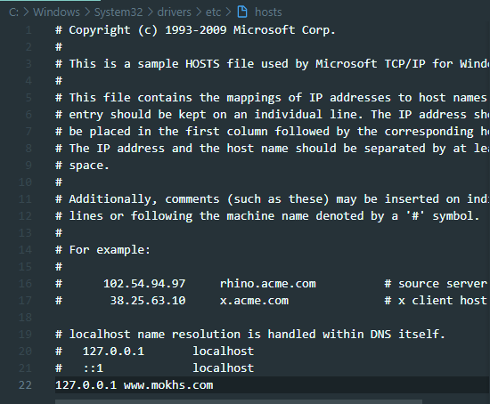
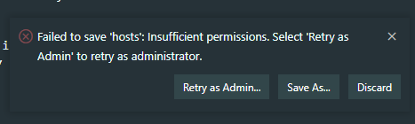

# 개요

window local환경에서 dns 설정을 해보자
기존에 localhost로 접속하던 걸 www.mokhs.com로 바꿔보자

# host 수정하기

```
C:\Windows\System32\drivers\etc
```

필자 기준(윈도우)으로 위 경로에 `hosts` 라는 파일이 있을 것이다.
이를 열어서 맨 아래에 다음과 같이 적어보자

```
127.0.0.1 www.mokhs.com
```



vscode로 작성 후 `hosts`파일 저장 시에 우측 하단에 다음과 같은 경고가 발생할 수 있는데
Retry as Admin을 눌러 관리자 권한으로 저장해준다.


이제 hosts에 작성한 도메인 이름(www.mokhs.com)으로 접속해보면 다음과 같이 localhost에 접속할 수 있다.

