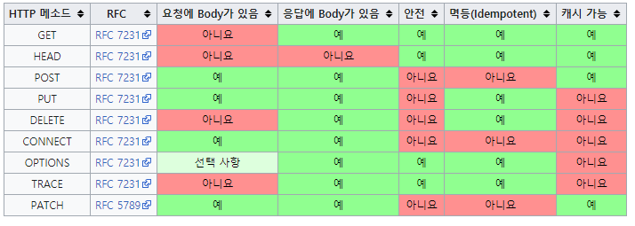

# HTTP 메서드

김영한님의 [모든 개발자를 위한 HTTP 웹 기본 지식](https://inf.run/MEw7) 강의를 수강하며 정리한 글입니다.

# GET

- 리소스 조회
- 서버에 전달하고 싶은 데이터는 query(쿼리 파마리터, 쿼리 스트링)을 통해서 전달
- 메시지 바디를 사용해서 데이터를 전달할 수 있지만, 지원하지 않는 곳이 많아서 권장하지 않음

```jsx
GET /boards?title=hello HTTP/1.1
Host: localhost:8080
```

# POST

- 요청 데이터 처리
- **메시지 바디를 통해 서버로 요청 데이터 전달**
- 서버는 요청 데이터를 처리
    - 메시지 바디를 통해 들어온 데이터를 처리하는 모든 기능을 수행
- **주로 신규 리소스 등록, 프로세스 처리 등에 사용**

### **스펙 상의 POST**

**POST 메서드는 대상 리소스가 리소스의 고유한 의미 체계에 따라 요청에 포함된 표현을 처리하도 요청합니다.**

위 내용을 정리하면 다음과 같음

- **이 리소스 URI에 POST요청이 오면 요청 데이터를 어떻게 처리할지 정해진 것이 없음**
- **즉.** **요청 데이터를 어떻게 처리할지 리소스마다 따로 정해야하고 이건 개발자 자유**
    - 새 리소스 생성
    - 요청 데이터 처리(내부 로직)
    - 다른 메서드로 처리하기 애매한 경우

```jsx
POST /boards HTTP/1.1
Content-Type: application/json

{
	"title": "hello",
  "content": "hi!"
}
```

# PUT

- 쉽게 말해서 덮어쓰기
- **리소스를 완전히 대체함**
    - 리소스가 있으면 대체
    - 리소스가 없으면 생성
- 중요! 클라이언트가 리소스를 식별
    - 클라이언트가 리소스 위치를 알고 URI 지정
    - **즉. boards/10 같이 10번 게시글이라는 것을 알고 있어야함.**
    - **리소스 위치를 알고 있어야 한다는 점에서 POST와 차이점이 있음**

### 리소스를 완전히 대체

기존에 10번 게시글이 다음과 같은 정보를 가지고 있었다고 해보자

```jsx
{
	"title" : "hello",
	"content" : "hi"
}
```

이 상황에서 다음과 같이 PUT 요청을 하면 

```jsx
PUT /boards/10 HTTP/1.1
Content-Type: application/json

{
	"title": "hello",
}
```

10번 게시글의 정보는 다음과 같이 **완전히 대체**된다

```jsx
{
	"title" : "hello",
}
```

# PATCH

- **리소스 부분 변경**
- PUT과 달리 리소스를 부분 변경하는 용도로 사용한다
- 아래 예시 처럼 요청을 보내면 기존 데이터 중 title만 "hi"로 변경한다.
- **주의! PATCH가 지원 안되는 서버가 있을 수 있음 → POST로 해결**

```jsx
PATCH /boards/10 HTTP/1.1
Content-Type: application/json

{
	"title": "hi",
}
```

# DELETE

- 리소스 삭제
- **클라이언트가 리소스 위치를 알고 있어야함**

```jsx
DELETE /boards/10 HTTP/1.1
Host: localhost:8080

{
	"title": "hi",
}
```

## 기타 메소드

- **HEAD**: GET과 동일하지만 메시지 부분을 제외하고, 상태 줄과 헤더만 반환
- **OPTIONS**: 대상 리소스에 대한 통신 기능 옵션(메서드)을 설명(주로 CORS에서 사용)
- **CONNECT**: 대상 자원으로 식별되는 서버에 대한 터널을 설정
- **TRACE**: 대상 리소스에 대한 경로를 따라 메시지 루프백 테스트를 수행

# HTTP 메서드의 속성

- 안전(Safe Methods)
- 멱등(Idenpotent Methods)
- 캐시가능(Cacheable Methods)

## 각 메서드가 가지는 속성들



[https://ko.wikipedia.org/wiki/HTTP](https://ko.wikipedia.org/wiki/HTTP)

## 안전(Safe)

- 호출해도 리소스를 변경하지 않는다.

## 멱등(Idenpotent)

- f(f(x)) = f(x)
- 한 번 호출하던 여러 번 호출하던 결과는 같아야함.
- 같은 요청에 대해서 같은 결과를 반환한다.
- 멱등 메서드
    - GET: 여러번 조회해도 같은 결과가 조회된다.
    - PUT: 결과를 대체. 따라서 같은 요청을 여러번 해도 최종 결과는 같음
    - DELETE: 결과를 삭제. 같은 요청을 여러번 해도 삭제된 결과는 같음
    - **POST: 멱등이 아님. 두 번 호출하면 같은 결제가 중복해서 발생할 수 있음**

- GET에 대해서 `중간에 데이터가 바뀌면 멱등이 아니지 않나?` 라는 의문점이 생기지만
- 멱등은 **외부 요인에 의해서 중간에 리소스가 변경되는 것까지 고려하지 않는다.**
- 따라서 GET을 멱등이라고 표현할 수 있다.

## 캐시 가능(Cacheable)

- 응답 결과 리소스를 캐시해서 사용해도 되는가?
- GET, HEAD, POST, PATCH 캐시가능
- **실제로는 GET, HEAD 정도만 캐시로 사용함**
    - POST, PATCH는 본문 내용까지 **캐시 키**로 고려해야하는데 구현이 쉽지 않음.