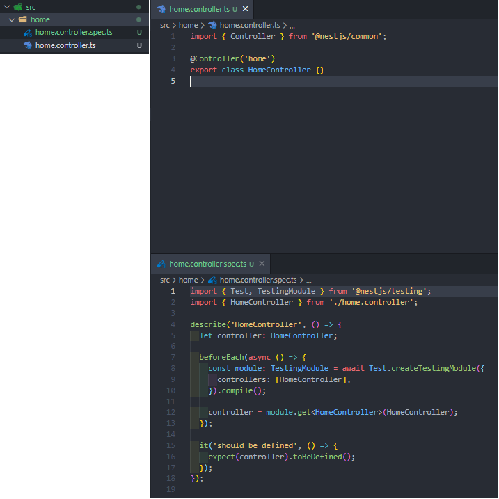

- [개요](#개요)
- [시작](#시작)
  - [프로젝트 구조 살펴보기](#프로젝트-구조-살펴보기)
  - [여러 플랫폼 호환](#여러-플랫폼-호환)
  - [애플리케이션 실행](#애플리케이션-실행)
- [컨트롤러(Controllers)](#컨트롤러controllers)
  - [기본 정의](#기본-정의)
  - [Controller 관련 데코레이터](#controller-관련-데코레이터)
    - [express 관련](#express-관련)
    - [HTTP method 관련](#http-method-관련)
    - [Status Code](#status-code)
    - [Response Header](#response-header)
    - [Redirection](#redirection)
    - [Route parameters](#route-parameters)
    - [Sub-Domain Routing](#sub-domain-routing)
  - [Nest CLI로 Controller 빠르게 생성하기](#nest-cli로-controller-빠르게-생성하기)
- [Providers](#providers)
  - [Services](#services)
  - [Dependency injection](#dependency-injection)
  - [Scopes](#scopes)
  - [Custom Providers](#custom-providers)
  - [Optional Providers](#optional-providers)
  - [Property-based injection](#property-based-injection)
  - [Provider registration](#provider-registration)
- [Modules](#modules)
  - [Shared modules](#shared-modules)

# 개요

NestJS에 대해서 학습합니다.

# 시작

NestJS에서는 Nest CLI를 제공한다. 이를 이용하면 새 프로젝트를 빠르게 시작할 수 있다.

``` bash
npm i -g @nestjs/cli
nest new project-name

```

## 프로젝트 구조 살펴보기

Nest CLI를 이용해서 프로젝트를 생성하면 다음과 같은 구조를 볼 수 있다.

```
src
├─app.controller.spec.ts
├─app.controller.ts
├─app.module.ts
├─app.service.ts
└─main.ts
```

각 파일은 다음을 의미한다.

- `app.controller.ts` : 단일 경로가 있는 기본 컨트롤러
- `app.controller.spec.ts` : 컨트롤러에 대한 단위 테스트
- `app.module.ts` : 애플리케이션 루트 모듈
- `app.service.ts` : service layer
- `main.ts` : core function인 NestFactory를 사용하여 Nest 애플리케이션 인스턴스를 생성하는 파일

**main.ts**를 살펴보면 다음과 같이 `AppModule`을 매개변수로 넘겨서 `NestFactory`를 생성하는 함수를 정의하고 해당 함수 **bootstrap()** 을 사용한다.

**이는 컨테이너(NestFactory)에 모듈로 정의한 것들을 미리 띄워놓는 듯하다.**

``` js
import { NestFactory } from '@nestjs/core';
import { AppModule } from './app.module';

async function bootstrap() {
  const app = await NestFactory.create(AppModule);
  await app.listen(3000);
}
bootstrap();


```

## 여러 플랫폼 호환

Nest는 플랫폼에 독립적인 것을 목표로 한다. 기술적으로 Nest Adapter가 생성되면 모든 Node Http 프레임워크에서 동작할 수 있다.
기본적으로 `express`와 `fastify`를 지원한다.

## 애플리케이션 실행

아래 명령어로 프로젝트를 실행한다.

``` bash
npm run start

```

package.json에서 start와 관련된 명령어만 가져와봤다.
참고로 `--watch`는 핫 리로드 옵션이다.

이외에 명령어들도 살펴보면 Nest가 자동으로 많은 것들을 지원하고 있다는 걸 알 수 있다.

``` json
{
    // ...
    "start": "nest start",
    "start:dev": "nest start --watch",
    "start:debug": "nest start --debug --watch",
    "start:prod": "node dist/main",
}
```

# 컨트롤러(Controllers)

컨트롤러는 기본적으로 클라이언트로부터 오는 HTTP 요청을 처리하고 응답을 반환하는 역할을 한다.
애플리케이션에서 컨트롤러는 기본적으로 라우팅에 의해서 특정 요청을 수신하고 응답을 처리하는데,
Nest에서는 이를 **데코레이터(@)** 로 손쉽게 설정할 수 있도록 지원한다.

## 기본 정의

nestjs에서는 `@Controller` 데코레이터를 사용해서 기본 컨트롤러를 정의한다.

기본적으로 다음과 같이 정의한다.
데코레이터를 사용하는 걸 보면 spring이 연상된다.

``` js
import {Controller, Get, HttpCode} from '@nestjs/common';

@Controller('cats')
export class CatsController {
  @Get()
  @HttpCode(HttpStatus.OK)
  findAll(): string {
    return 'This action returns all cats';
  }
} 
```

## Controller 관련 데코레이터

### express 관련

다음은 express에서 사용하던 방식이 호환되는 **데코레이터(@)** 이다.

express에 typing을 하고 싶다면 `@types/express` 패키지를 설치하자.

기본적인 import는 다음과 같다.

``` js
import { Controller, Post, Req } from '@nestjs/common';
import { Request } from 'express';

@Controller('home')
export class HomeController {
  @Post()
  create(@Req() req: Request): string {
    return 'create';
  }
}

```

이제 여러가지 express관련 데코레이터를 정리해보자

| 데코레이터(@)             | express                             |
| ------------------------- | ----------------------------------- |
| `@Request(), @Req()`      | `req`                               |
| `@Response(), @Res()`     | `res`                               |
| `@Next()`                 | `next`                              |
| `@Session()`              | `req.session`                       |
| `@Param(key?: string)`    | `req.params` / `req.params[key]`    |
| `@Body(key?: string)`     | `req.body` / `req.body[key]`        |
| `@Query(key?: string)`    | `req.query` / `req.query[key]`      |
| `@Headers(name?: string)` | `req.headers` / `req.headers[name]` |
| `@Ip()`                   | `req.ip`                            |
| `@HostParam()`            | `req.hosts`                         |

### HTTP method 관련

All은 모든 요청을 처리함
`@Get()`, `@Post()`, `@Put()`, `@Delete()`, `@Patch()`, `@Options()`, `@Head()`, `@All()`

### Status Code

response status code를 다음과 같이 간단하게 설정 가능하다.  

`@HttpCode(200)`
`@HttpCode(HttpStatus.OK)`

``` js
import { Controller, HttpCode, Post, Req } from '@nestjs/common';
import { Request } from 'express';

@Controller('home')
export class HomeController {
  @Post()
  @HttpCode(201)
  create(@Req() req: Request): string {
    return 'create';
  }
}
```

### Response Header

`@nestjs/common` package의 `@Header()` 를 사용해서 response에 header를 넘겨줄 수 있다.

``` js
@Post()
@Header('Cache-Control', 'none')
create() {
  return 'This action adds a new cat';
}

```

### Redirection

`@Redirect()`를 이용해 redirect 가능
매개변수로 url, statusCode를 받음 statusCode는 default 값으로 302(Found)

``` js
@Redirect('https://github.com/mokhs00', 301)
```

return 값을 통해서 매개변수(url, statusCode)를 변경할 수 있다.

return 값 형식은 다음과 같다

``` js
{
  "url": string,
  "statusCode": number
}
```

``` js
@Get('github')
@Redirect('https://github.com/mokhs00', 302)
toGithub(@Query('name') name){
  if(name){
    return { url: `https://github.com/${name}` }
  }
}
```

### Route parameters

`@Param()`을 이용해서 path parameter 가져오기 가능

``` js
@Get(':id')
findOne(@Param() params): string {
  return `This action returns a ${params.id}`
}
```

아래 방식도 가능

``` js
@Get(':id')
findOne(@Param('id') id): string {
  return `This action returns a ${id}`
}
```

### Sub-Domain Routing

- `@Controller` 데코레이터에 host option을 사용해 HTTP 호스트가 특정값과 일치하도록 할 수 있다.

``` ts
@Controller({ host: 'admin.example.com' })
export class AdminController {
  @Get()
  index(): string {
    return 'Admin page';
  }
}
```

- 아래와 같이 `@HostParam`을 이용해서 동적값을 캡처할 수도 있다.

``` ts
@Controller({ host: ':account.example.com' })
export class AccountController {
  @Get()
  getInfo(@HostParam('account') account: string) {
    return account;
  }
}
```

## Nest CLI로 Controller 빠르게 생성하기

Nest CLI를 이용해서 다음과 같이 입력하면 controller를 빠르게 생성해준다.

``` bash
nest g controller home
```

해당 명령어를 입력하면 src 아래에 다음과 같은 구조로 코드들이 자동으로 생성된다

심지어 app.module.ts에도 자동으로 등록해준다.



``` js
import { Module } from '@nestjs/common';
import { AppController } from './app.controller';
import { AppService } from './app.service';
import { HomeController } from './home/home.controller';

@Module({
  imports: [],
  controllers: [AppController, HomeController],
  providers: [AppService],
})
export class AppModule {}

```

# Providers

- 프로바이더는 Nest의 기본 개념이며, 서비스, 리포지토리, 팩토리, 헬퍼 등 대부분의 기본 Nest 클래스는 프로바이더로 취급될 수 있다.
- 프로바이더의 주요 아이디어는 종속성을 주입할 수 있다는 것이고, Spring에서 Spring Bean을 주입하는 것과 유사하다는 느낌이 든다.
- `@Injectable` 데코레이터를 붙여서 `Provider`로 선언한다.
- 이는 Nest IoC 컨테이너가 관리할 수 있는 클래스임을 선언하는 메타데이터를 첨부한다.

## Services

- 다음은 `Service layer`의 코드를 `Controller`에서 생성자 주입 받는 코드이다.
- Controller에서 생성자에 private를 선언하여 주입 받는 것을 확인하자. 이는 약식(shorthand = 줄임말)으로 사용된다고 한다.

``` ts
// dogs.service.ts

import { Injectable } from '@nestjs/common';
import { Dog } from 'interfaces/dogs.interface';

@Injectable()
export class DogsService {
  private readonly dogs: Dog[] = [];

  create(dog: Dog) {
    this.dogs.push(dog);
  }

  findAll(): Dog[] {
    return this.dogs;
  }
}
```

``` ts
// dogs.controller.ts

import { Body, Controller, Get, Post } from '@nestjs/common';
import { Dog } from 'src/dogs/dogs.interface';
import { CreateDogDto } from './create-dog.dto';
import { DogsService } from './dogs.service';

@Controller('dogs')
export class DogsController {
  constructor(private readonly dogsService: DogsService) { }

  @Post()
  async create(@Body() createDogDto: CreateDogDto) {
    this.dogsService.create(createDogDto);
  }

  @Get()
  async findAll(): Promise<Dog[]> {
    return this.dogsService.findAll();
  }
}

```

## Dependency injection

- 위에서 살펴본 것처럼 다음과 같이 작성하면 Nest에서 생성자 Dependency Injection(의존성 주입)을 받을 수 있다.
- 물론 spring 과 유사하게 필드 주입도 가능하겠지만, 이는 이후에 다룬다.

``` ts
constructor(private dogsService: DogsService) {}
```

## Scopes

- Provider는 일반적으로 애플리케이션 수명주기와 동기화된 수명(범위=scope)를 갖는다.
- 애플리케이션이 `bootstrap`되면, 모든 종속성을 해결해야하므로 모든 `provider`를 인스턴스화 해야하고, 당연한 얘기지만, 애플리케이션이 종료되면 각 `provider`는 메모리에서 제거된다.
- 그러나 이러한 provider의 수명을 요청 범위로 만드는 방법도 있다고 한다. 이는 이후 `Injection Scope`에서 다룬다.

## Custom Providers

- 프로바이더를 정의하는 방법에는 여러가지가 있고, 일반 값, 클래스 및 비동기 또는 동기 팩토리를 사용할 수 있다. 이는 이후 `Custom Provider`에서 다룬다.

## Optional Providers

- 경우에 따라 반드시 필요하지 않은 종속성이 있을 수 있다.
- 예를 들어, 구성 객체에 종속될 순 있지만, 전달되는 것이 없으면 기본 값을 사용해야하는 경우를 들 수 있다.
- 프로바이더가 선택사항임을 나타내려면 생성자에 `@Optional()` 데코레이터를 사용하자.
- 아래 예시는 `HTTP_OPTIONS`라는 커스텀 토큰을 포함한다.
- 커스텀 프로바이더 및 관련 토큰에 대한 내용은 이후 `Custom Provider`에서 다룬다.

``` ts

import { Injectable, Optional, Inject } from '@nestjs/common';

@Injectable()
export class HttpService<T> {
  constructor(@Optional() @Inject('HTTP_OPTIONS') private httpClient: T) {}
}
```

## Property-based injection

- 속성 기반 의존성 주입도 가능하다.
- 클래스 상속의 경우에 최상위 클래스가 여러 프로바이더에 의존하는 경우 생성자의 하위 클래스에서 `super()`를 호출하여 모든 프로바이더를 전달하는 것은 매우 지루할 수 있다.
- 이를 방지하기 위해서 속성 수준에서 의존성 주입이 가능하도록 `@Inject` 데코레이터를 지원한다.
- **하지만 클래스가 다른 프로바이더를 확장하지 않는 경우 생성자 기반 주입을 선호해야함을 주의하자.**

``` ts
import { Injectable, Inject } from '@nestjs/common'

@Injectable()
export class HttpService<T> {
  @Inject('HTTP_OPTIONS')
  private readonly httpCliect: T;
}

```

## Provider registration

- Provider를 정의했으니 Nest의 컨테이너에서 이를 관리할 수 있도록 설정해주어야 한다.
- 다음과 같이 모듈 파일의 `@Module` 데코레이터의 `providers` 배열에 해당 Provider를 추가하자.
- 여기서는 DogsService를 Provider로 추가했다.

``` ts
// dogs.module.ts

import { Module } from '@nestjs/common';
import { DogsService } from './dogs.service';
import { DogsController } from './dogs.controller';

@Module({
  controllers: [DogsController],
  providers: [DogsService]
})
export class DogsModule {}
```

- 추가로 최상위 모듈에선 다음과 같이 하위 모듈을 추가한다.
- @Module의 imports에 DogsModule을 확인하자.

``` ts
// app.module.ts
import { Module } from '@nestjs/common';
import { AppController } from './app.controller';
import { AppService } from './app.service';
import { DogsModule } from './dogs/dogs.module';

@Module({
  imports: [DogsModule],
  controllers: [AppController],
  providers: [AppService],
})
export class AppModule {}
```

# Modules

- Nest에서 모듈이란 `@Module` 데코레이터로 주석이 달린 클래스를 말한다.
- `@Module()` 데코레이터는 Nest가 애플리케이션 구조를 구성하는데 사용하는 메타데이터를 제공한다(설정)

- 각 애플리케이션에는 `루트 모듈(root module)`이라는 하나 이상의 모듈이 존재한다.
- **루트 모듈은 Nest가 애플리케이션 그래프를 빌드하는데 사용하는 시작점이며**
- **Nest가 모듈과 공급자 관계 및 종속성을 해결하는데 사용하는 내부 데이터 구조이다.**
- Nest 공식 문서에선 모듈은 구성요소를 구성하는 효과적인 방법으로 적극 권장한다고. 강조되어있다.
- 아키텍처에 따라 모듈을 잘 캡슐화하여서 구성하는 것이 중요하다.

`@Module()` 데코레이터는 속성이 모듈을 설명하는 단일 객체를 매개변수로 받는다. 해당 매개변수는 다음과 같다.

| 매개변수      | 설명                                                                          |
| ------------- | ----------------------------------------------------------------------------- |
| `providers`   | Nest 인젝터에 의해 인스턴스화 되고 적어도 이 모듈에서 공유될 수 있는 provider |
| `controllers` | 인스턴스화 되어야하는 해당 모듈에 정의된 컨트롤러                             |
| `imports`     | 이 모듈에 필요한 프로바이더를 내보내는 다른 모듈 = import 해야하는 모듈 목록  | `exports` | 이 모듈에서 제공하고, 이 모듈을 import하는 다른 모듈에서 사용할 수 있어야하는 provider 집합 |

**모듈은 기본적으로 provider를 캡슐화하고, 현재 모듈에 직접 포함되거나 가져온 모듈에서 내보내지 않은 프로바이더를 삽입할 수 없다.
따라서 모듈에서 내보낸 프로바이더를 모듈의 공용 인터페이스 또는 API로 간주할 수 있다.**


## Shared modules

- Nest에서 모듈은 기본적으로 **싱글톤**이므로 여러 모듈간에 쉽게 프로바이더의 동일한 인스턴스를 공유할 수 있다.
- 모든 모듈은 자동으로 공유 모듈이며, 인스턴스화되면, 모든 모듈에서 재사용할 수 있다. 
- `@Module()` 데코레이터의 옵션에 exports와 imports를 통해서 모듈을 공유할 수 있다.
- 만약에 DogsService를 다른 모듈에서 공유하고 싶다면 다음과 같이 하면 된다.
  
``` ts
// dogs.module.ts

import { Module } from '@nestjs/common';
import { DogsService } from './dogs.service';
import { DogsController } from './dogs.controller';

@Module({
  controllers: [DogsController],
  providers: [DogsService],
  exports: [DogsService]
})
export class DogsModule {}
```