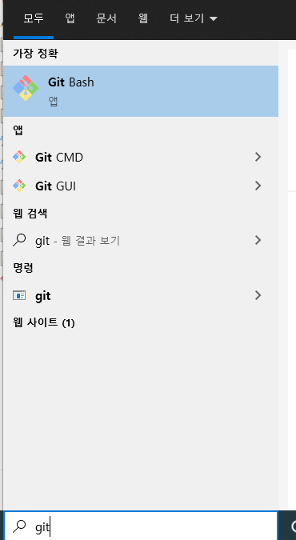

# ssh 편하게 하기 (+윈도우)

# 개요

jenkins 공부하다가 ssh 편하게 하는 방법을 발견해서 정리한 글입니다.

**핵심은 원래 ssh 접속 시에 putty같은 툴을 사용하거나 비밀번호를 입력하던 걸
미리 다른 config 파일에 저장해두어서 최적화 하는 것입니다.**

본 글은 pem 키 방식을 기준으로 작성되어 있습니다.

# 환경 구성

Mac 사용자시라면 Git Bash 관련 과정은 넘어가도 됩니다

Window라면 Git Bash를 통해 linux 명령어를 사용할 수 있습니다.

**Git Bash가 없다면 설치해주세요.
아마 Git 설치 시에 기본 옵션으로 선택하셨다면 이미 설치되어 있을 겁니다!**



# ssh config

이제부터 **~/.ssh 폴더**에 모든 설정을 저장할 것입니다. 시작해보죠!

먼저 .ssh 폴더를 생성합니다.

```java
mkdir ~/.ssh
```

그리고 설정을 저장할 config 파일을 생성해 줄 것입니다.
편집기를 열어서 저장하면 파일이 자동 생성 됩니다.

아래 명령어를 입력해서 편집기를 열어주세요

```java
vim ~/.ssh/config
```

편집기가 열렸으면 아래와 같이 작성해줍니다.

`IdentityFile`에는 pem 키 파일의 경로를 작성하고 저장해주세요.

```java
Host test-jenkins
	User ec2-user
	HostName IP
	IdentityFile ~/.ssh/test-jenkins.pem
```


# ssh 접속

설정을 마쳤다면 아래 명령어로 ssh 접속을 해보세요!
test-jenkins는 Host에 기술한 내용과 일치해야합니다.

```java
ssh test-jenkins
```

성공!


# 참고

[https://jojoldu.tistory.com/427](https://jojoldu.tistory.com/427)

[https://www.youtube.com/watch?v=GOLHN3FHjpI](https://www.youtube.com/watch?v=GOLHN3FHjpI)
