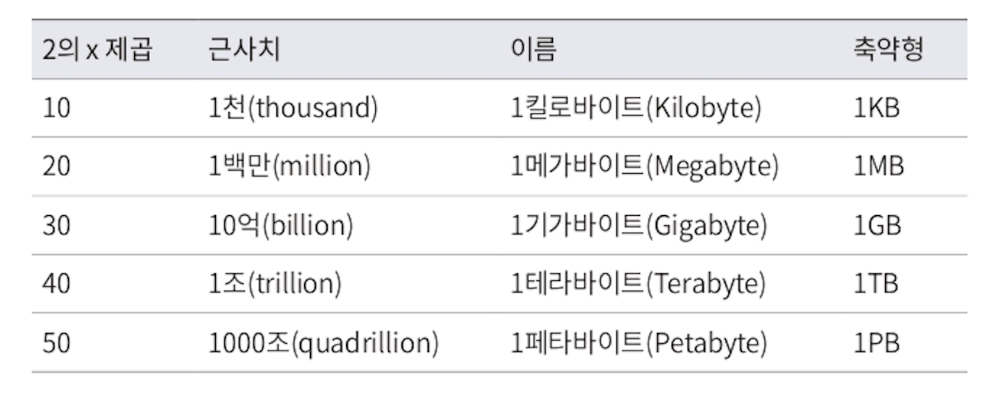
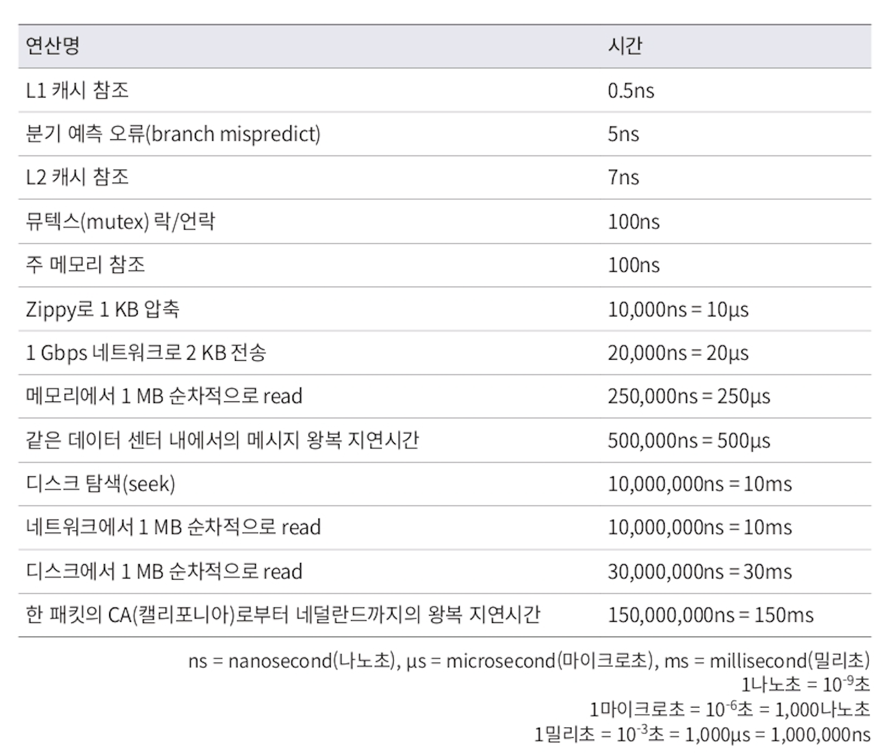
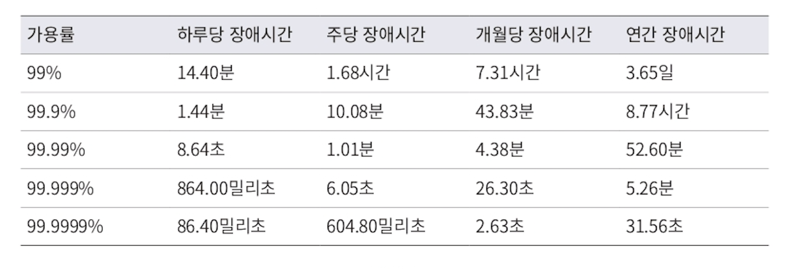

# 개요

- [가상 면접 사례로 배우는 대규모 시스템 설계 기초](http://www.yes24.com/Product/Goods/102819435)책을 읽고 내용을 상기 하기위해 정리 및 기록합니다.

- [개요](#개요)
  - [사용자 수에 따른 규모 확장성](#사용자-수에-따른-규모-확장성)
    - [데이터베이스](#데이터베이스)
      - [어떤 데이터베이스를 사용할 것인가?](#어떤-데이터베이스를-사용할-것인가)
    - [수직적 규모 확장 vs 수평적 규모 확장](#수직적-규모-확장-vs-수평적-규모-확장)
    - [로드밸런서](#로드밸런서)
    - [데이터베이스 다중화](#데이터베이스-다중화)
    - [캐시](#캐시)
      - [캐시 계층](#캐시-계층)
      - [캐시 사용 시 유의할 점](#캐시-사용-시-유의할-점)
    - [콘텐츠 전송 네트워크(CDN)](#콘텐츠-전송-네트워크cdn)
      - [CDN 사용 시 고려할 점](#cdn-사용-시-고려할-점)
    - [무상태(stateless) 웹 계층](#무상태stateless-웹-계층)
      - [상태 정보 의존적인 아키텍쳐](#상태-정보-의존적인-아키텍쳐)
      - [무상태 아키텍처](#무상태-아키텍처)
    - [데이터 센터](#데이터-센터)
    - [메시지 큐](#메시지-큐)
    - [로그, 메트릭 그리고 자동화](#로그-메트릭-그리고-자동화)
    - [데이터베이스의 규모 확장](#데이터베이스의-규모-확장)
    - [note. 시스템 규모 확장 기법 정리](#note-시스템-규모-확장-기법-정리)
  - [개략적인 규모 측정](#개략적인-규모-측정)
    - [2의 제곱수](#2의-제곱수)
    - [모든 프로그래머가 알아야 하는 응답지연 값(latency)](#모든-프로그래머가-알아야-하는-응답지연-값latency)
    - [가용성에 관계된 수치들](#가용성에-관계된-수치들)
    - [QPS와 저장소 요구량 추정해보기](#qps와-저장소-요구량-추정해보기)
    - [TIP Note](#tip-note)
  - [시스템 설계 면접 공략법](#시스템-설계-면접-공략법)
    - [효과적 면접을 위한 4단계 접근법](#효과적-면접을-위한-4단계-접근법)
      - [1단계: 문제 이해 및 설계 범위 확정](#1단계-문제-이해-및-설계-범위-확정)
      - [2단계: 개략적인 설계안 제시 및 동의 구하기](#2단계-개략적인-설계안-제시-및-동의-구하기)
      - [3단계: 상세 설계](#3단계-상세-설계)
      - [4단계: 마무리(후속 질문 등)](#4단계-마무리후속-질문-등)
    - [note. 시스템 설계 면접에서 해야 할 것과 하지 말아야 할 것들](#note-시스템-설계-면접에서-해야-할-것과-하지-말아야-할-것들)
  - [처리율 제한 장치의 설계](#처리율-제한-장치의-설계)
    - [rate limiter 요구 사항](#rate-limiter-요구-사항)
    - [처리율 제한 장치의 구현](#처리율-제한-장치의-구현)
    - [처리율 제한 알고리즘](#처리율-제한-알고리즘)
      - [토큰 버킷 알고리즘](#토큰-버킷-알고리즘)
      - [누출 버킷 알고리즘](#누출-버킷-알고리즘)
      - [고정 윈도 카운터 알고리즘](#고정-윈도-카운터-알고리즘)
      - [이동 윈도 로깅 알고리즘](#이동-윈도-로깅-알고리즘)
      - [이동 윈도 카운터 알고리즘](#이동-윈도-카운터-알고리즘)
    - [rate limiter의 개략적인 아키텍처](#rate-limiter의-개략적인-아키텍처)
    - [분산 환경에서의 rate limiter](#분산-환경에서의-rate-limiter)
    - [rate limiter 성능 최적화](#rate-limiter-성능-최적화)
    - [모니터링](#모니터링)
    - [추가로 면접에서 얘기해볼만한 것들](#추가로-면접에서-얘기해볼만한-것들)
  - [안정 해시](#안정-해시)
    - [해시 공간과 해시 링](#해시-공간과-해시-링)
    - [해시링에서의 서버 조회](#해시링에서의-서버-조회)
    - [서버 추가와 삭제](#서버-추가와-삭제)
    - [가상 노드를 활용한 균등 분포](#가상-노드를-활용한-균등-분포)
    - [note. 안정 해시의 이점과 사용 사례](#note-안정-해시의-이점과-사용-사례)

## 사용자 수에 따른 규모 확장성

- 수백만 사용자를 지원하는 시스템을 설계하는 것은 도전적인 과제이며, **지속적인 계량과 끝없는 개선이 요구되는 여정**이다.
- 한 명의 사용자를 지원하는 시스템에서 시작하여, 최종적으로 몇백만 사용자를 지원하는 시스템을 설계하는 방법에 대해 알아보자.

### 데이터베이스

- 사용자가 늘면 서버 하나로는 충분하지 않아 여러 서버를 두어야한다.
- 하나는 웹/모바일 트래픽 처리 서버(웹 계층), 데이터베이스 서버(데이터 계층)이다.
- 이 계층을 분리하면 각각 독립적으로 확장해 나갈 수 있다.

#### 어떤 데이터베이스를 사용할 것인가?

- 기본적으로 과거 오래전부터 쓰인 `관계형 데이터베이스`(Realational database)와 `비-관계형 데이터베이스` 사이에서 고를 수 있다.
- 이 두 데이터베이스는 다음과 같은 차이가 있다.
  - `관계형 데이터베이스`(RDBMS)
    - 관계형 데이터베이스 관리 시스템(RDBMS: Relation Data-base Management System)라고도 부른다.
    - 대표적인 것으로 MySQL, 오라클, PostgreSQL 등이 존재
    - 자료를 테이블과 열, 칼럼으로 표현하며 SQL을 사용하면 여러 테이블에 있는 데이터를 **그 관계에 따라 조인(Join)** 하여 합칠 수 있다.
  - `비 관계형 데이터베이스`(NoSQL)
    - NoSQL이라고도 부른다.
    - 대표적인 것으로 AWS DynamoDB, HBase, Cassandra, Neo4j, CouchDB, MongoDB, Redis 등이 있다.
    - NoSQL은 다음과 같은 네 부류로 나눌 수 있다.
      - `키-캆 저장소(key-value store)`
      - `그래프 저장소(graph store)`
      - `칼럼 저장소(column store)`
      - `문서 저장소(document store)`
    - 비-관계형 데이터베이스는 일반적으로 조인 연산을 지원하지 않는다.
- 대부분의 개발자에게는 RDBMS가 40년 이상 살아남아 잘 사용된 검증된 시스템이라는 점에서 사용하기에 최선일 것이다.
- **하지만 시스템에 따라서 비-관계형 데이터베이스가 더 적합할 수 있다. 이 경우는 다음과 같다**
  - 아주 낮은 응답 지연시간(latency)이 요구됨
  - 다루는 데이터가 비정형(unstructured)이라 관계형 데이터가 아님
  - 데이터(JSON, YAML, XML 등)를 직렬화하거나 역직렬화 할 수 있기만 하면 됨
  - 아주 많은 양의 데이터를 저장할 필요가 있음

### 수직적 규모 확장 vs 수평적 규모 확장

- `수직적 규모 확장`(vertical scaling)
  - **스케일 업(scale up)** 이라고도 함
  - 서버에 고사양 자원(CPU, RAM 등)을 추가하여 성능을 개선하는 행위
- `수평적 규모 확장`
  - **스케일 아웃(scale out)** 이라고도 함
  - 더 많은 서버를 추가하여 성능을 개선하는 행위
- 서버에 유입되는 트래픽의 양이 적을 때는 `수직적 규모 확장(스케일 업)`이 가장 단순하기에 좋은 선택일 수 있다. 하지만 이는 다음과 같은 한계점, 단점을 가진다
  - 한 대의 서버에 CPU나 메모리를 무한대로 증설할 방법은 없다
  - 장애에 대한 **자동복구(failover)** 방안이나 **다중화(redundancy)** 방안을 제시하지 않는다.
  - 즉 서버에 장애가 발생하면 웹사이트/앱은 완전히 중단된다 => **굉장히 치명적**
- `스케일 업`은 위와 같은 단점을 가지기에 대규모 애플리케이션을 지원하는 데는 보통 `스케일 아웃` 방식이 적절하고 이를 위해 로드밸런서를 이용한다

### 로드밸런서

- `로드밸런서`는 **부하 분산 집합(load balancing set)에 속한 웹 서버들에게 트래픽 부하를 고르게 분산하는 역할을 한다.**
- 스케일 아웃 방식을 확장할 때 사용하며 부하 분산 집합에 또 하나의 웹 서버를 추가하면 장애를 자동복구하지 못하는 **no failover 문제를 해소**하며 **웹 계층의 가용성(availability)을 향상**시킨다.
- 로드밸런서 + health check를 이용해 서버 장애 상태에 따라 오토스케일링 등을 통해 유연한 확장 및 장애 복구를 할 수도 있다.

### 데이터베이스 다중화

- 많은 데이터베이스 관리 시스템은 다중화를 지원하며 보통 서버 사이에 **주(master)-부(slave)관계**를 설정하고 데이터 원본은 주 서버에, 사본은 부 서버에 저장하는 방식이다. (slave를 read replica라고도 표현한다)
- **쓰기 연산(write operation)은 master에서만 지원하며, slave는 master로부터 해당 데이터 사본을 전달받게 되고 읽기 연산(read operation)만을 지원한다.**
- 대부분의 애플리케이션은 읽기 연산의 비중이 쓰기 연산보다 훨씬 높아 slave 수가 master보다 많다.
- 데이터베이스를 다중화 하게 되면 다음과 같은 이점이 있다
  - `처리 성능 향상`: 읽기 연산은 slave 데이터베이스들로 분산되므로 병렬로 처리될 수 있는 질의(query)의 수가 늘어나 전체적인 처리 성능이 좋아진다.
  - `안정성(reliability)`: 데이터를 지역적으로 떨어진 여러 장소에 다중화 시켜두면 자연 재해 등으로 데이터베이스 서버 일부가 파괴되어도 데이터는 보존된다.
  - `가용성(availability)`: 데이터를 여러 지역에 복제해 둠으로써 하나의 데이터베이스 서버에 장애가 발생하더라도 다른 서버에 있는 데이터를 가져와 계속 서비스를 할 수 있게 된다.
- 이와 관련해서 특정 데이터베이스가 다운되는 경우 다음과 같은 상황들이 있을 수 있다.
  - slave가 하나인 상태에서 해당 slave가 다운된 경우, 읽기 연산은 한시적으로 모두 master로 전달된다. slave가 여러 개인 상황에서는 장애가 발생하지 않은 다른 slave로 읽기 연산이 전달된다.
  - master가 다운된 경우, slave 중 하나가 master가 되며 기존에 빈 자리를 채우기 위해 새로운 slave가 하나 추가된다.
  - 운영 환경에서는 더 복잡한 일들이 벌어지는데, master에 저장된 데이터가 최신 상태가 아닐 수 있고 이를 위해 없는 데이터를 **복구 스크립트(recovery script)**를 돌려 추가하거나 **다중 마스터(multi-masters)** 나 **원형 다중화(circular replication)** 방식을 도입하면 이런 상황에 대처하는 데 도움이 될 수도 있다. 하지만 해당 구성은 훨씬 복잡하며 실제 운영에서는 각 상황에 맞게 트레이드오프를 고려해야만 한다.

### 캐시

- 캐시는 값비싼 연산 결과 또는 자주 참조되는 데이터를 메모리 안에 두고, 뒤이은 요청이 보다 빨리 처리될 수 있도록 하는 저장소로 사용된다.
- 애플리케이션의 성능은 데이터베이스를 얼마나 자주 호출하느냐에 크게 영향을 받는데, 캐시는 이 문제를 완화할 수 있다.

#### 캐시 계층

- 캐시 계층(cache tier)은 데이터가 잠시 보관되는 곳으로 데이터베이스보다 훨씬 빠르다.
- 따라서 별도의 캐시 계층을 두면 성능이 개선될 뿐만 아니라 데이터베이스의 부하를 줄일 수 있고, 캐시 계층의 규모를 독립적으로 확장시키는 것도 가능하다.
- 캐싱에는 다양한 전략들이 존재하며, 캐시할 데이터의 종류, 크기, 데이터 접근 패턴에 맞는 각 캐시 전략을 잘 조합하여 선택해야한다
- 예시로 다음과 같은 전략들이 존재한다.
  - `Look-Aside 읽기 전략(=Lazy Loading)`
    - 캐시에 데이터가 없으면 DB에서 데이터를 조회하고 이를 캐시에도 추가한다.
    - 찾는 데이터가 없을 때 DB에서 직접 조회해서 입력하기 때문에 Lazy Loading이라고 한다.
    - 데이터가 없을 시 connection을 3번(Cache Hit, DB Read, Cache Write)해야한다
    - 대부분의 상황에서 사용되며 굉장히 쉽다
  - `Read-Through 읽기 전략`
    - 데이터를 읽을 때 캐시로만 데이터를 읽어오고 Cache Miss가 발생하면 DB에서 해당 데이터를 캐시에 바로 저장한다.
    - Look-Aside는 Cache Miss가 발생하면 앱이 직접 DB에 데이터를 조회하는 반면, Read-Through은 앱이 아닌 캐시에서 DB에 데이터를 직접 조회하여 로드한다.
    - 동일한 데이터가 여러번 읽기 요청 되는 경우에 적합하다
  - `Write-Through 쓰기 전략`
    - 캐시에서만 데이터를 조회하고 DB에서 update, create가 발생했을 때 해당 데이터를 cache에 저장한다.
    - DB에 데이터 추가 → cache sync 과정에서 sync 이전에 데이터를 조회하는 경우가 있을 수 있다 (=데이터 유실) 그래서 보통 Lazy Loading 전략과 결합하여 사용한다.
    - 많은 데이터를 저장해 일부 데이터가 읽히지 않는 경우 리소스 손실이 발생한다. 따라서 캐시 무표화를 위해 캐시 만료 시간인 `TTL`(Time To Leave)를 설정해주는 것이 좋다
    - Raed-Through 읽기 전략과 함께 사용하면 Read-Through의 모든 이점을 얻을 수 있고 데이터 일관성도 보장되어 캐시 무효화를 사용하지 않아도 된다.

#### 캐시 사용 시 유의할 점

캐시 사용 시에는 다음 사항들을 고려해야 한다.

- **캐시는 어떤 상황에서 바람직한가?**
  - 데이터 갱신은 자주 일어나지 않지만 참조는 빈번하게 일어난다면 고려해볼만하다.
- **어떤 데이터를 캐시에 두어야하는가?**
  - 휘발성 메모리에 캐시를 두므로 영속적으로 보관할 데이터를 캐시에 두는 것은 바람직하지 않다.
- **캐시에 보관된 데이터는 어떻게 만료(expire)되는가?**
  - 이에 대한 정책을 마련해두는 것은 굉장히 중요하다.
  - 만료 정책이 없으면 데이터는 캐시에 계속 남게되고 만료 시간을 너무 짧게 잡거나 너무 길게 잡으면 데이터베이스 연산을 너무 자주하거나 최신의 데이터가 아닐 가능성이 높다(=원본 데이터와 차이 발생)
- **일관성(consistency)은 어떻게 유지되는가?**
  - 일관성은 데이터 저장소의 원본과 캐시 내의 사본이 같은지 여부이다.
  - 저장소의 원본을 갱신하는 연산과 캐시를 갱신하는 연산이 단일 트랜잭션으로 처리되지 않는 경우 이 일관성은 깨질 수 있다. 여러 지역에 걸쳐 시스템을 확장하는 경우에는 캐시와 저장소 사이의 일관성을 유지하는 것은 더더욱 어려운 문제가 된다.
- **장애에는어떻게 대처할 것인가?**
  - 캐시 서버를 한 대만 두는 경우 해당 서버는 전체 시스템의 동작을 중단시켜 버릴 수 있는 단일 장애 지점(SPOF: Single Point Of Failure)이 되어버릴 가능성이 있다.
  - 따라서 캐시 서버도 여러 지역에 걸쳐 분산시켜야한다.
- **캐시 메모리는 얼마나 크게 잡을 것인가?**
  - 캐시 메모리가 너무 작으면 데이터 접근 패턴에 따라 데이터가 너무 자주 캐시에서 밀려나버려(eviction) 캐시의 성능이 떨어진다.
  - 이를 막을 한 가지 방법은 **캐시 메모리를 과할당(overprovision)** 하는 것이다. 이렇게 하면 캐시에 보관될 데이터가 갑자기 늘어났을 때 생길 문제도 방지할 수 있게 된다.
- **데이터 방출(eviction) 정책은 무엇인가?**
  - 캐시가 꽉 차버리면 추가로 캐시에 데이터를 넣어야 할 경우 기존 데이터를 내보내야(`eviction`) 한다.
  - 캐시 데이터 방출 정책에는 다음과 같은 정책들이 있으며 경우에 맞게 적용 가능하다.
  - `LRU`(Least Recently Used - 마지막으로 사용된 시점이 가장 오래된 데이터를 내보냄) -> **가장 널리 쓰임**
  - `LFU`(Least Frequently Used - 사용 빈도가 가장 낮은 데이터를 내보냄)
  - `FIFO`(First In First Out - 선입선출)

### 콘텐츠 전송 네트워크(CDN)

- `CDN`은 **정적 콘텐츠(JS, CSS, 이미지 등)를 전송하는 데 쓰이는, 지리적으로 분산된 서버의 네트워크이다.**
- 어떤 사용자가 웹사이트에 방문하면 해당 사용자와 지리적으로 가까운 CDN 서버가 정적 콘텐츠를 전달하게 된다. 이는 지리적으로 가까우므로 로드 시간에 이점을 가진다
- 오청 경로, query string, 쿠키, 요청 헤더 등의 정보에 기반하여 HTML을 캐싱하는 동적 콘텐츠를 캐싱하는 것도 가능한데 이는 [AWS CloudFront 동적 콘텐츠 전송](https://aws.amazon.com/ko/cloudfront/dynamic-content/)문서를 살펴보자.

#### CDN 사용 시 고려할 점

- **비용**: CDN은 보통 제3 사업자(third-party providers)에 의해 운영되므로 해당 데이터 전송 양에 따라 요금이 발생한다. 자주 사용되지 않는 컨텐츠를 캐싱하는 것은 이득이 크지 않으므로, CDN에서 빼는 것을 고려하자.
- **적절한 만료 시한 설정**: 시의성이 중요한(time-sensitive) 컨텐츠의 경우 만료 시점을 적절히 설정해야한다. 너무 길면 컨텐츠의 신선도가 떨어지고, 너무 짧으면 원본 서버에 빈번히 접속하게 된다.
- **CDN 장애에 대한 대처 방안**: CDN 자체에 장애가 발생했을 경우 웹사이트/애플리케이션이 어떻게 동작해야 하는지 고려해야한다. 가량 일시적으로 CDN이 응답하지 않을 경우, 해당 문제를 감지하여 원본 서버로부터 직접 컨텐츠를 가져오도록 클라이언트를 구성하는 것이 필요할 수 있다.
- **컨텐츠 무효화(invalidation) 방법**: 아직 만료되지 않은 컨텐츠라 하더라도 아래 방법 가운데 하나를 사용하면 CDN에서 제거할 수 있다.
  - CDN 서비스 사업자가 제공하는 API를 이용해 컨텐츠 무효화
  - 컨텐츠의 다른 버전을 서비스하도록 `오브젝트 버저닝(object versioning)`을 이용. 컨텐츠의 새로운 버전을 지정하기 위해서는 URL 마지막에 버전 번호를 인자로 주면 된다. e.g. image.png?v=3

### 무상태(stateless) 웹 계층

- 웹 계층을 수평적으로 확장하는 방법을 알아보자.
- 이를 위해서는 상태 정보(사용자 세션 데이터 등)를 웹 계층에서 제거하여 의존성을 제거해야한다.
- 바람직한 전략은 상태 정보를 지속성 저장소(관계형 DB나 NoSQL)에 보관하고, 필요할 때 조회하는 것이다.
- 상태 정보를 제거하여 이렇게 구성된 웹 계층을 `무상태 웹 계층`이라고 부른다.

#### 상태 정보 의존적인 아키텍쳐

- 사용자 A의 상태 정보(세선 정보, 프로필 이미지 등)가 서버 1에 저장되어 있다면 사용자 A의 요청은 반드시 서버 1에 저장되어야 한다. 그렇지 않고 서버 2에 저장되면 이미 인증을 하여 세션에 인증 정보가 서버 1에 저장된 상황에서 서버 2에는 인증 정보가 없기 때문에 인증이 실패하게 된다.
- 스케일 아웃 환경에서 이런 경우를 방지하기 위해 대부분의 로드밸런서는 `고정 세션`(sticky session) 기능을 제공하고 있는데, 이는 로드밸런서에 부담을 주고 로드밸런서 뒷단에 서버를 추가하거나 제거하기가 까다로워지며 서버의 장애를 처리하기도 복잡해지는 단점이 있다.

#### 무상태 아키텍처

- 위와같은 상태 정보 의존적 아키텍처에서 상태 정보를 **공유 저장소(shared storage)** 로부터 가져오게 함으로써 `무상태 아키텍처`를 구성할 수 있다.
- `공유 저장소`는 RDBMS나 Memcached/Redis 같은 캐시 시스템 혹은 NoSQL일 수도 있다.
- 이렇게 하면 상태 정보가 웹 서버들로부터 제거되었으므로 트래픽 양에 따라 웹 서버를 추가하거나 제거하면 자동으로 규모를 확장할 수 있게 된다.

### 데이터 센터

- 가용성을 높이고 전 세계 어디서도 쾌적하게 사용할 수 있도록 하기 위해 여러 데이터 센터를 지원해야할 수도 있다.
- 장애가 없는 상황에서 사용자는 가장 가까운 데이터 센터로 안내되는데, 이를 `지리적 라우팅`(geoDNS-routing or geo-routing)이라고 부른다.
- `geoDNS`는 사용자의 위치에 따라 도메인 이름을 어떤 IP 주소로 변환할지 결정할 수 있도록 해주는 DNS 서비스이다. 일정 가중치를 두어 어떤 데이터센터에 지리적 위치 기준으로 몇 %의 사용자를 안내할지 결정할 수도 있다.
- 다중 데이터센터 아키텍처를 만드려면 다음과 같은 기술적 난제를 해결해야한다.
  - **트래픽 우회**
    - 올바른 데이터 센터로 트래픽을 보내는 효과적인 방법을 찾아야 한다. GeoDNS는 사용자에게서 가장 가까운 데이터센터로 트래픽을 보낼 수 있도록 해준다.
  - **데이터 동기화(synchronization)**
    - 데이터 센터마 다 별도의 데이터베이스를 사용하고 있는 상황이라면 failover해서 트래픽이 다른 데이터베이스로 우회한다고 해도 해당 데이터센터에는 찾는 데이터가 없을 수 있다.
    - 이런 상황을 막는 보편적 전략은 데이터를 여러 데이터 센터에 걸쳐 다중화 하는 것이다.
  - **테스트와 배포(deployment)**
    - 여러 데이터 센터를 사용하도록 시스템이 구성된 상황이라면 여러 위치에서 테스트해보는 것이 중요하다. 그리고 자동화된 배포 도구는 모든 데이터 센터에 동일하게 서비스가 설치되도록 하는 데 중요한 역할을 한다.

### 메시지 큐

**시스템을 더 큰 규모로 확장하기 위해서는 시스템의 컴포넌트를 분리하여, 각기 독립적으로 확장될 수 있도록 해야한다.** `메시지 큐(message queue)`는 많은 실제 분산 시스템에서 이 문제를 풀기 위해 사용하는 핵심적인 전략 중 하나이다.

- 메시지 큐는 메시지의 `무손실`(durability, 메시지 큐에 보관된 메시지는 소비자가 꺼낼 때까지 안전하게 보관됨)을 보장하고 `비동기 통신`을 지원하는 컴포넌트이며 메시지의 버퍼 역할을 하고 이를 비동기적으로 전송한다.
- 메시지 큐의 기본 아키텍처는 다음과 같다.
  - **생산자 또는 발행자**(producer/publisher)라고 불리는 입력 서비스가 **메시지를 생성하여 메시지 큐에 발행**(publish)
  - **소비자 혹은 구독자**(consumer/subscriber)라고 불리는 서비스 혹은 서버가 **메시지를 받아 그에 맞는 동작을 수행**
- 메시지 큐를 이용하면 서비스 또는 서버 간 결합이 느슨해져 규모 확장성이 보장되어야 하는 안정적인 애플리케이션을 구성하기 좋다.
- 생산자는 소비자 프로세스가 다운되어 있어도 메시지를 발행할 수 있고, 소비자는 생상자 서비스가 가용한 상태가 아니더라도 메시지를 수신할 수 있다.

### 로그, 메트릭 그리고 자동화

소규모일 때는 로그, 메트릭(metric) 그리고 자동화(automation)가 있으면 좋지만 트레이드오프를 고려해 챙기지 못할 수 있다. 하지만 웹 사이트와 사업 규모가 커지고 나면, 필연적으로 이에 투자해야한다.

- **로그**
  - 에러 로그를 모니터링하는 것은 시스템의 오류와 문제들을 보다 쉽게 찾아낼 수 있기에 중요하다.
  - 에러 로그는 서버 단위로 모니터링 할 수도 있지만, 단일 서비스에 로그를 모아주는 도구를 활용하면 좀 더 편리하게 검색하고 조회할 수 있다.
- **메트릭(metric)**
  - 메트릭을 잘 수집하면 사업 현황에 관한 유용한 정보를 얻을 수도 있고, 시스템의 현재 상태를 손쉽게 파악할 수도 있다. 메트릭 가운데 특히 유용한 것들은 다음과 같다.
    - **호스트 단위 메트릭**: CPU, 메모리, 디스크 I/O에 관한 메트릭
    - **종합(aggregated) 메트릭**: 데이터베이스 계층의 성능, 캐시 계층의 성능
    - **핵심 비즈니스 메트릭**: 일별 능동 사용자(DAU: Daily Active User), 수익(Revenue), 재방문(Retention)
- **자동화(automation)**
  - 시스템이 크고 복잡해지면 생산성을 높이기 위해 자동화 도구를 활용해야 한다.
  - 지속적 통합(CI: Continuous Integration)도구를 이용하면 개발자가 만드는 코드를 특정 검증 절차를 자동으로 거치도록하여 문제를 쉽게 감지할 수도 있고
  - 빌드, 테스트, 배포 등의 절차도 자동화하여 개발 생산성을 크게 향상시킬 수 있다.

### 데이터베이스의 규모 확장

저장할 데이터가 많아지면 DB에도 부하가 증가하고, DB를 증설할 방법을 찾아야한다.

- 데이터베이스 규모 확장에는 `수직적 규모 확장(스케일 업)`, `수평적 규모 확장(스케일 아웃, 샤딩)` 이렇게 두 가지 접근법이 있다.
- `수직적 확장(스케일 업)`
  - 기존 서버에 고성능의 자원을 증설하는 방법이다.(CPU, RAM, 디스크 등)
  - AWS RDS는 24TB RAM을 갖춘 서버도 상품으로 제공하고 있다고 한다. 이 정도 수준의 고성능 데이터베이스 서버는 많은 양의 데이터를 보관하고 처리할 수 있다.
  - 예를 들어 스택오버플로(stackoverflow.com)는 2013년 한 해 동안 방문한 천만 명의 사용자 전부를 단 한대의 마스터 데이터베이스로 처리하였다.
  - 하지만 이러한 수직적 접근법에는 몇가지 심각한 약점이 있다.
    - **데이터베이스 서버 하드웨어에 한계가 있으므로 무한 증설이 불가능하다. 사용자가 늘어나면 결국에는 한 대 서버로는 감당하기 힘들다.**
    - **SPOF(Single Point Of Failure)로 인한 위험성이 크다.**
    - **고성능 서버 사용으로 인한 서버 비용이 많이 든다.**
- `수평적 확장(스케일 아웃, 샤딩)`
  - **샤딩(sharding)** 이라고도 부르며 더 많은 서버를 추가함으로써 성능을 향상시킬 수 있다.
  - `샤딩`은 대규모 데이터베이스를 샤드(shard)라고 부르는 작은 단위로 분할하는 기술이다.
  - 모든 샤드는 같은 스키마를 쓰지만 샤드에 보관되는 데이터 사이에는 중복이 없다.
  - e.g. 예를 들어 4개의 샤드가 있다면 사용자 데이터를 어느 샤드에 넣을지는 사용자 ID에 따라 결정된다고 했을 때, `user_id % 4` 등의 연산을 통해 어떤 샤드에 해당 데이터를 저장할지 결정할 수 있다.
  - `샤딩 키(sharding key)`
    - 샤딩 전략을 구현할 때 고려해야할 가장 중요한 것은 **샤딩 키(sharding key)를 어떻게 정하느냐**이다. 이는 파티션 키(partition key)라고도 부른다.
    - 샤딩 키는 데이터가 어떻게 분산될지 정하는 하나 이상의 칼럼으로 구성되며 예를 들면 user_id가 될 수도 있다.
    - 샤딩 키를 정할 때는 데이터가 고르게 분산될 수 있도록 하는 게 가장 중요하다.
  - **샤딩은 데이터베이스 규모 확장을 실현하는 훌륭한 기술이지만 완벽하진 않다. 샤딩을 도입하면 시스템이 복잡해지고 풀어야 할 새로운 문제도 생긴다.**
    - `데이터 재 샤딩(resharding)`
      - 다음과 같은 특정 경우에 재 샤딩이 필요한 경우가 생길 수 있다.
        - 데이터가 너무 많아져서 하나의 샤드로는 더 이상 감당하기 어렵거나
        - 샤드 간 데이터 분포가 균등하지 못하여 어떤 샤드에 할당된 공간 소모가 다른 샤드에 비해 빨리 진행될 때. **샤드 소진(shard exhaustion)** 이라고도 부르는 이 현상이 발생했을 경우
    - `유명인사(celebrity) 문제`
      - `핫스팟 키(hotspot key)`문제라고도 부름
      - 특정 샤드에 질의가 집중되어 서버에 과부하가 걸리는 문제 e.g. 유명인사(연예인, 인플루언서 등)가 전부 같은 샤드에 저장되는 데이터베이스가 있다면 이 데이터베이스에 read 연산량이 많아서 과부하가 걸릴 수 있다.
      - 이 문제를 풀려면 경우에 따라 나열한 유명인사 각각에 샤드 하나씩을 할당해야 할 수도 있고, 심지어는 더 잘게 쪼개야 할 수도 있다.
    - `조인과 비정규화(join and de-normalization`
      - 하나의 데이터베이스를 여러 샤드로 쪼개고 나면 여러 샤드에 걸친 데이터를 조인하기 힘들어진다. 이를 해결하는 방법은 데이터베이스를 정규화하여 하나의 테이블에서 질의가 수행될 수 있도록 하는 것이다.

### note. 시스템 규모 확장 기법 정리

- 웹 계층을 무상태 계층으로
- 모든 계층에 다중화 도입
- 가능한 한 많은 데이터를 캐시할 것
- 여러 데이터 센터를 지원할 것
- 정적 콘텐츠는 CDN을 통해 서비스할 것
- 데이터 계층은 샤딩을 통해 그 규모를 확장할 것
- 각 계층은 독릭접 서비스로 분할할 것
- 시스템을 지속적으로 모니터링하고, 자동화 도구들을 활용할 것

## 개략적인 규모 측정

시스텀 설계 면접을 볼 때, 때는 시스템 용량이나 성능 요구사항을 개략적으로 추정해 보라는 요구를 받게 된다. `개략적 규모 추정`을 효과적으로 해 내려면 규모 확정성을 표현하는데 필요한 기본기에 능숙해야 한다. 특히 `2의 제곱수`나 `응답지연(latency)` 값, 그리고 `가용성에 관련된 수치`들을 기본적으로 잘 이해하고 있어야 한다.

### 2의 제곱수

- 분산 시스템에서 다루는 데이터 양은 엄청나게 커질 수 있으나 그 계산법은 기본을 크게 벗어나지 않는다.
- 데이터의 크기를 계산하기 위해서는 데이터 볼륨의 단위를 2의 제곱수로 표현하면 어떻게 되는지 우선 알아야한다. 1바이트=8비트, ASCII 문자 하나=1바이트 등등
- 다음은 흔히 쓰이는 데이터 볼륨 단위를 표로 나타낸 것이다. 외울 필요는 없지만 익숙해질 필요는 있을 것 같다.

### 모든 프로그래머가 알아야 하는 응답지연 값(latency)

- 다음 표는 구글의 제프 딘이 2010년에 공개한 통상적인 컴퓨터에서 구현된 연산들의 응답지연 값이다.
- 이들 가운데 몇몇은 더 빠른 컴퓨터가 등장하면서 더 이상 유효하지 않게 되었지만, 이 수치들은 컴퓨터 연산들의 처리 속도가 어느 정도인지 짐작할 수 있게 해준다.
- 아래 수치들을 살펴보면 다음과 같은 사실을 발견할 수 있다.
  - **메모리는 빠르지만 디스크는 아직도 느리다.**
  - **디스크 탐색(seek)은 가능한 한 피하라.**
  - **단순한 압축 알고리즘은 빠르다.**
  - **데이터를 인터넷으로 전송하기 전에 가능하면 압축하라.**
  - **데이터 센터는 보통 여러 지역(region)에 분산되어 있고, 센터들 간에 데이터를 주고받는 데는 시간이 걸린다.**

### 가용성에 관계된 수치들

- 고가용성을 표현하는 값은 퍼센트(percent)로 표현하는데 100%는 시스템이 단 한 번도 중단된 적이 없었음을 의미한다. 대부분의 서비스는 99%~100%의 값을 갖는다
  - `고가용성(high availability)`: 시스템이 오랜 시간 동안 지속적으로 중단없이 운영될 수 있는 능력을 지칭하는 용어
- `SLA`(Service Level Agreement)는 서비스 사업자(service provider)가 보편적으로 사용하는 용어로, 서비스 사업자와 고객 사이에 맺어진 합의를 의미하며 여기에는 `서비스 가용시간`(uptime)이 공식적으로 기술되어 있다.
- 아마존, 구글, 마이크로소프트 같은 사업자는 99% 이상의 SLA를 제공한다.
- 가용시간은 관습적으로 숫자 9를 사용해 표시하며 9가 많을수록 좋다고 보면 된다 이에 대한 수치는 다음 표를 확인하자

### QPS와 저장소 요구량 추정해보기

- 다음 제시된 수치들로 QPS와 저장소 요구량을 추정해보자 (트위터의 기능을 예시로 든다)
- `가정`
  - **MAU(월간 능동 사용자: Monthly Active User)**는 3억(300million)
  - 50%의 사용자가 트위터를 매일 사용한다. (retention rate = 50%)
  - 평균적으로 각 사용자는 매일 2건의 트윗을 올린다
  - 미디어를 포함하는 트윗은 10% 정도다
  - 데이터는 5년간 보관한다
- `추정`
  - **QPS(Query Per Second) 추정치**
    - **DAU(일간 능동 사용자: Daily Active User)** = 3억 x 50% = 1.5억(150million)
    - QPS= 1.5억 x (2번의 트윗) / (24시간) / (3600초) = 약 3500
    - 따라서 최대 QPS(Peek QPS) = 2 X `QPS` = 약 7000
  - **미디어 저장을 위한 저장소 요구량**
    - 평균 트윗 크기
      - tweet_id: 64byte
      - text: 140byte
      - 미디어: 1MB
    - 미디어 저장소 요구랑: 1.5억 x 2 x 10% x 1 MB = 30TB / 일
    - 5년간 미디어를 보관하기 위한 저장소 요구량: 30TB x 365 x 5 = 약 55PB

### TIP Note

- 개략적인 규모 추정과 관계된 면접에서 가장 중요한 것은 문제를 풀어 나가는 절차이다.
- 결국 면접자가 보고 싶어 하는 것은 당신의 문제 해결 능력일 것이기에 올바른 절차를 밟느냐가 결과를 내는 것보다 중요하다.
- `TIPs`
  - **근사치를 활용한 계산(rounding and approximation): 면접장에서 복잡한 계산을 하는 것은 어려운 일이고, 계산 결과의 정확함을 평가하는 자리가 아니다. 그러므로 적절한 근사치를 활용해서 시간을 절약하자**
  - **가정(assumption)들은 기록해둬라. 나중에 이를 살펴볼 수 있도록 해야한다**
  - **단위(unit)을 붙여라. 5라고만 적으면 5KB인지 5MB인지 알 수 없으므로 스스로 헷갈릴 수 있다. 단위를 붙이는 습관을 들여 모호함을 방지하자**
  - 많이 출제되는 개략적 규모 추정 문제는 QPS, 최대 QPS, 저장소 요구량, 캐시 요구량, 서버 수 등을 추정하는 것이다. 면접에 임하기 전에 이런 값들을 계산하는 연습을 미리 하도록 하자. 완벽함을 달성하는 방법은 연습뿐이다.

## 시스템 설계 면접 공략법

- 항상 무언가를 공략하기 위해서는 근본적인 원리를 찾는 것이 중요하다.
- 시스템 설계 면접의 근본적인 요소들을 알아보고 정리해보자.
- **회사에서 시스템 설계 면접을 보는 이유가 무엇일까?**
  - 이에 대한 대답은 각기 다를 수 있지만, 시스템 설계 면접은 두 명의 동료가 모호한 문제를 풀기 위해 협력하여 그 해결책을 찾아내는 과정에 대한 시뮬레이션이다. 즉 이 문제에는 정해진 결말, 정답이 없다.
  - 그리고 이 면접은 당신의 설계 기술을 시연하는 자리이고, 설계 과정에서 내린 결정들에 대한 방어 능력을 보이는 자리이며, 면접관의 피드백을 건설적인 방식으로 처리할 자질이 있음을 보이는 자리인 것이다.
- **입장 바꿔서 면접관은 어떤 생각을 가지고 면접 자리에 들어올까?**
  - 일차적 목표는 지원자의 능력을 평가하는 것이다. 즉 면접이 매끄럽게 진행되지 않아서 충분한 시그널을 수집하지 못한 바람에 평가 결과를 확정 지을 수 없는 상황을 피하고 싶을 것이다.
  - 그리고 지원자가 내 바로 옆자리 동료가 될 수 있으니 같이 일하기에 좋은 사람인가?를 추가적으로 살펴보고 싶어할 것이다. 많은 사람이 지원자의 설계 능력의 기술적 측면을 평가하는 것이 주된 것이라 생각할 수 있지만, 사실 그 이상으로 지원자가 협력에 적합한 사람인지, 압박이 심한 상황도 잘 헤쳐나갈 자질이 있는지, 모호한 문제를 건설적으로 해결할 능력이 있는지 등을 살펴볼 수 있다.
  - 또한 훌륭한 면접관은 부정적인 신호를 놓치지 않는다. 완고함, 편협함, 설계의 순수성에 집착한 나머지 trade-off를 도외시하고 over-engineering을 할 것인지 등등

### 효과적 면접을 위한 4단계 접근법

그리고 긴장감이 생긴 상태에서는 그 가능성이 좀 더 높아진다. 시스템 설계 면접은 전부 제각각이고 훌륭한 설계 면접은 정해진 결말도 없고 정답도 없다. 하지만 그 절차나 범위에는 공통적인 부분이 있다. 효과적인 면접을 위해서 4단계 접근법을 정리해보고 이에 대비해보자.
p.s 사람은 늘 실수할 가능성이 있기 마련이다. 그리고 프로 선수는 대부분의 긴장되는 상황에서도 탁월하게 일을 해낸다. 그들은 이런 준비를 항상 미리 해두기 때문에 프로가 된 게 아닐까?

#### 1단계: 문제 이해 및 설계 범위 확정

시스템 설계 면접을 볼 때는 생각 없이 바로 답을 내서는 좋은 점수를 받기 어렵다.

- 요구사항을 완전히 이해하지 않고 답을 내놓는 행위는 아주 엄청난 부정적 신호(red flag)이다. 면접은 퀴즈쇼가 아니며, 정답 따위는 없다는 걸 상기하자
- 바로 답부터 들이밀지 말고 깊이 생각하고 질문하여 요구사항과 가정들을 분명히 하라. 이 단계의 중요성은 강조하고 또 강조해도 모자람이 없다.
- **엔지니어가 가져야 할 가장 중요한 기술 중 하나는 올바른 질문을 하는 것, 적절한 가정을 하는 것, 그리고 시스템 구축에 필요한 정보를 모으는 것이다**
- 문제 이해를 위해 다음과 같은 질문들을 해볼 수 있을 것 같다.
  - 구체적으로 어떤 기능을 만들어야 하나?
  - 제품 사용자 수는 얼마나 되나?
  - 회사의 규모는 얼마나 빨리 커지리라 예상하나? 석 달, 여섯 달, 일년 뒤의 규모는 얼마가 되리라 예상하는가?
  - 회사가 주로 사용하는 기술 스택은 무엇인가? 설계를 단순화하기 위해 활용할 수 있는 기존 서비스로는 어떤 것들이 있는가?

#### 2단계: 개략적인 설계안 제시 및 동의 구하기

이번 단계에서는 개략적인 설계안을 제시하고 면접관의 동의를 얻는 것에 집중해야한다. 이 과정은 면접관과 협력하여 진행하면 좋다. 원활한 소통으로 같이 일하기 좋은 사람임을 보여주면 좋다.

- **설계안에 대한 최초 청사진을 제시하고 의견을 구하라. 면접관을 마치 팀원인 것처럼 대하라. 훌륭한 면접관들은 지원자들과 대화하고 설계 과정에 개입하기를 즐긴다.**
- **화이트보드나 종이에 핵심 컴포넌트를 포함하는 다이어그램을 그려라. 클라이언트(모바일/웹), API, 웹 서버, 데이터 저장소, 캐시, CDN, 메시지 큐 같은 것들이 포함될 수 있을 것이다.**
- **이 최초 설계안이 시스템 규모에 관게된 제약사항들을 만족하는지를 개략적으로 계산해 보라. 계산 과정은 소리 내어 설명하라. 아울러, 이런 개략적 추정이 필요한지는 면접관에게 미리 물어보도록 하자.**

#### 3단계: 상세 설계

이 단계로 왔다면 당신은 면접관과 다음 목표는 달성한 상태일 것이다.

- **시스템에서 전반적으로 달성해야 할 목표와 기능 범위 확인**
- **전체 설계의 개략적 청사진 마련**
- **해당 청사진에 대한 면접관의 의견 청취**
- **상세 설계에서 집중해야 할 영역들 확인**

이 상황에서 이제 면접관과 해야 할 일은 설계 대상 컴포넌트 사이의 우선순위를 정하는 것이다. 똑같은 면접이란 있을 수 없으니 정해진 것은 없지만, 보통 면접자가 특정 시스템 컴포넌트의 세부사항을 깊이 있게 설명하는 것을 보길 원한다. 케이스가 너무 많아서 정답은 없으나 여기서 주의점은 다음과 같다.

- 시간 관리에도 특별히 주의를 기울이자. 사소한 세부사항을 설명하느라 정작 당신의 능력을 보일 기회를 놓쳐버릴 수도 있다. 면접관에게 긍정적 신호(signal)를 전달하는 데에 집중하고 불필요한 세부사항에 시간을 쓰지 말자.
- EdgeRank 알고리즘 등 특정 알고리즘에 대해 깊게 이야기 하는 것은 바람직하지 않을 수 있다. 시간을 너무 많이 쓰게 되는데다 당신이 규모 확장 가능한 시스템을 설계할 능력이 있다는 것을 입증하는 데도 도움이 되지 않는다.

#### 4단계: 마무리(후속 질문 등)

이 마지막 단계에서 면접관은 설계 결과물에 관련된 몇 가지 후속 질문을 던질 수도 있고 당신이 스스로 추가 논의를 진행하도록 할 수도 있다. 다음 몇 가지 지침을 활용하자.

- **면접관이 시스템 병목구간, 혹은 좀 더 개선한 지점을 찾아내라 주문할 수 있다. 개선할 점은 언제나 있기 마련이고 현재 설계가 완벽하다거나 개선할 부분이 없다는 답은 하지 않도록 하자. 이런 질문은 당신의 비판적 사고 능력을 보이고, 마지막으로 좋은 인상을 남길 기회이다.**
- **당신이 만든 설계를 한번 다시 요약해주는 것도 도움이 될 수 있다. 여러 해결책을 제시한 경우에는 특히 중요하며 긴 면접 세션이 끝난 뒤에 면접관의 기억을 환기시켜주는 효과도 있다.**
- **오류가 발생하면 무슨 일이 생기는지(서버 오류, 네트워크 장애 등) 따져보면 흥미로울 것이다.**
- **운영 이슈도 논의할 가치가 충분하다. 메트릭은 어떻게 수집하고 모니터링할 것인가? 로그는? 시스템은 어떻게 배포해(roll-out) 나갈 것인가?**
- **미래에 닥칠 규모 확장 요구에 어떻게 대처할 것인지도 흥미로운 주제다. e.g. 현재 설계로 백만 사용자는 능히 감당할 수 있다고 해보자. 천만 사용자를 감당하려면 어떻게 해야 하는가?**
- **시간이 좀 남았다면, 필요하지만 다루지 못했던 세부적 개선사항들을 제안할 수 있다.**

### note. 시스템 설계 면접에서 해야 할 것과 하지 말아야 할 것들

면접 세션에서 해야 할 것과 하지 말아야 할 것을 정리해보자

- `해야 할 것`
  - **질문을 통해 확인하라(clarification). 스스로 내린 가정이 옳다 믿고 진행하지 말라.**
  - **문제의 요구사항을 이해하라.**
  - **정답이나 최선의 답안 같은 것은 없단느 점을 명심하라. 스타트업을 위한 설계안과 수백만 사용자를 지원해야 하는 중견 기업을 위한 설계안이 같을리 없다. 요구사항을 정확하게 이해했는지 다시 확인하라.**
  - **면접관이 여러분의 사고 흐름을 이해할 수 있도록 하라. 면접관과 소통하라.**
  - **가능하다면 여러 해법을 함께 제시하라.**
  - **개략적 설계에 면접관이 동의하면, 각 컴포넌트의 세부사항을 설명하기 시작하라. 가장 중요한 컴포넌트부터 진행하라.**
  - **면접관의 아이디어를 이끌어 내라. 좋은 면접관은 여러분과 같은 팀원처럼 협력한다.**
  - **포기하지 말라.**
- `하지 말아야 할 것`
  - **전형적인 면접 문제들에도 대비하지 않은 상태로 면접장에 가지 말라.**
  - **요구사항이나 가정들을 분명히 하지 않은 상태에서 설계를 제시하지 말라.**
  - **처음부터 특정 컴포넌트의 세부사항을 너무 깊이 설명하지 말라. 개략적 설계를 마친 뒤에 세부사항으로 나아가라.**
  - **진행 중에 막혔다면, 힌트를 청하기를 주저하지 말라.**
  - **소통을 주저하지 말라. 침묵 속에 설계를 진행하지 말라.**
  - **설계안을 내놓는 순간 면접이 끝난다고 생각하지 말라. 면접관이 끝났다고 말하기 전까지는 끝난 것이 아니다. 의견을 일찍, 그리고 자주 구하라.**

## 처리율 제한 장치의 설계

**네트워크 시스템에서 처리율 제한 장치(rate limiter)는 클라이언트 또는 서비스가 보내는 트래픽의 처리율(rate)를 제어하기 위한 장치이다.**

`rate limiter`에 정의된 `임계치`(threshold)를 넘어서면 추가로 도달한 모든 호출은 처리가 중단(block)된다.

rate limiter는 특정 상황에서 필요한데, 몇 가지 예를 들어보면 다음과 같다.

- **DoS(Denial of Service) 공격에 의한 자원 고갈(resource starvation) 방지**
- **비용 절감**
  - e.g. 제3자(third-party) API 사용량에 따라 사용료를 지불해야한다면 이를 절약해볼 수도 있다.
- **서버 과부하 방지**
  - 봇(bot)에서 오는 트래피이나 사용자의 잘못된 이용패턴으로 유발된 트래픽을 걸러낼 수 있다.
- **+외부 서비스 트래픽 제어 요청**
  - 실제로 협역하는 외부 서비스(신용조회 등)에서 트래픽 제어를 요청할 수도 있다.

### rate limiter 요구 사항

**보통 rate limiter에 대한 요구사항은 다음과 같은 것들이 있을 수 있다.**

- `정확한 제한`: 설정된 초과율을 초과하는 요청은 정확하게 제한한다.
- `낮은 응답시간`: HTTP latency에 부정적 영향을 주어서는 곤란함.
- `분산 시스템 고려`: 분산형 처리율 제한(distributed rate limiting)
- `예외 처리`: 요청이 제한되었을 때 확실한 피드백 e.g. 429(Too Many Request)
- `높은 결함 감내성(fault tolerance)`: 제한 장치에 장애가 생기더라도 전체 시스템에 영향을 주어선 안됨(**no SPOF**)

### 처리율 제한 장치의 구현

**사실상 클라이언트/서버 어디서든 구현할 수 있지만 어디에 두느냐에 각 트레이드오프에 따라 안정성(신뢰성)과 효율성, 유연성에서 차이가 날 수 있다. 즉 상황에 맞추어 나름 최적의 선택을 할 뿐. 정답은 없다.**

- `클라이언트 측에 둔다면`: 클라이언트 요청을 쉽게 위변조 가능하므로 안정적이지 않음
- `서버 측에 둔다면`: 안정성을 챙겨갈 수 있음 그리고 이는 효율성, 유연성 면에서 API gateway(middleware)에 두느냐 API서버에 두느냐에 따라 디테일이 달라짐
  - `API gateway를 이용하면`: 만약에 MSA 구조라면 API gateway를 미들웨어로 두어 처리율 제한을 전체적으로 한 번에 적용할 수 있기 때문에 생산성면에서 효율적일 수 있다.
  - `API 서버를 이용하면`: 요구사항에 따라 특정 서비스에 대해서만 처리율 제한을 해야한다면 API 서버에서 구현해야할 수도 있다. e.g. 외부 서비스
- **note;**
  - 보통 클라우드에서 제공하는 완전관리형(fully-managed) API gateway는 middleware 역할로 처리율 제한, SSL 종단(termination), authentication, whitelist 등을 지원한다.
  - 요즘에는 k8s에서 같은 pod(instance)안에 미들웨어 역할을 하는 서버를 하나를 더 두는 sidecar패턴으로 middleware를 관리하기도 한다.
  - 매번 그렇지만 운영환경에서의 트레이드를 오프를 고려해서 적절한 방식을 고려하자. 회사의 기술스택, 엔지니어링 인력, 우선순위, 목표에 따라 달라질 수도 있다.

### 처리율 제한 알고리즘

처리율 제한을 구현을하는 알고리즘은 다음과 같이 여러가지인데 각각에 대해 알아보자.

모두 외울 필요는 없고 적절한 상황에 어떤 것을 활용하는 것이 좋은가 정도를 이해해보면 좋을 것 같다.

- `토큰 버킷 알고리즘`(token bucket)
- `누출 버킷 알고리즘`(leaky bucket)
- `고정 윈도 카운터`(fixed window counter)
- `이동 윈도 로그`(sliding window log)
- `이동 윈도 카운터`(sliding window counter)

#### 토큰 버킷 알고리즘

**토큰 버킷을 두고 버킷에 담긴 토큰만큼의 요청을 처리한다**

- 기업들에서 보편적으로 사용되어 레퍼런스가 많다. 아마존, 스트라이프가 API요청을 통제(throttle)하기 위해 이 알고리즘을 활용한다.
- **동작 원리는 다음과 같다**
  - 먼저 여기서 제시하는 숫자들은 유동적일 수 있으니 유의하자.
  - 기본적으로 버킷에 요청을 처리할 수 있는 토큰(일종의 입장권)을 저장한다
    - e.g. 용량이 4인 버킷에 매초 2개의 토큰을 추가하고
    - 버킷이 가득 차면 추가로 공급된 토큰은 버려진다(overflow)
  - 각 요청이 처리될때 해당 버킷에서 토큰을 하나 꺼낸 후 요청을 처리한다.
    - 버킷에 토큰이 없을 때 들어온 요청은 그대로 버려진다(dropped)
  - 이렇게 하면 처리율을 제한할 수 있다.
- 정리해보면 다음 두 가지 값을 적절히 튜닝해볼 수 있을 것 같다.
  - **버킷 크기**: 버킷에 담을 수 있는 토큰의 최대 개수
  - **토큰 공급률(refill rate)**: 초당 몇 개의 토큰을 버킷에 공급할 것인가
- 버킷을 여러개 사용할 수도 있다.
  - API Endpoint마다, IP 주소별로, 전체적인 시스템의 처리율을 제한하고 싶다면 적절한 수의 버킷을 배치해야 한다.
- `장점`
  - 구현이 쉽고
  - 메모리 사용 측면에서 효율적이며
  - 짧은 시간에 집중되는 트래픽(burst of traffic)도 처리 가능하다.
- `단점`
  - 버킷의 크기와 토큰 공급률을 튜닝하는 것이 굉장히 까다롭다

#### 누출 버킷 알고리즘

**토큰 버킷 알고리즘과 유사하지만, 요청 처리율이 고정되어 있다는 점이 다르다.**

- 보통 FIFO 큐로 구현한다.
- **동작원리는 다음과 같다.**
  - 요청이 도착하면 큐에 요청을 담을 수 있는지 확인하고 요청을 빈자리에 담는다.
  - 큐가 가득차 있는 경우 요청을 버리고
  - 지정된 시간마다 큐에서 요청을 꺼내 처리한다.
- 누출 알고리즘도 다음 두 가지 값을 적절히 튜닝해볼 수 있을 것 같다.
  - **버킷 크기**: 큐 사이즈
  - **처리율**(outflow rate): 지정된 시간당 몇 개의 요청을 처리할 것인가
- `장점`
  - 큐의 크기가 제한되어 메모리 사용량 측면에서 효율적
  - **고정된 처리율을 가지고 있어 안정된 출력(stable outflow rate)이 필요한 경우 적합**
- `단점`
  - 단시간에 많은 트래픽이 몰리는 경우 많은 최신 요청들이 버려지게 될 수 있음
  - 버킷 크기, 처리율을 튜닝하기 까다로움

#### 고정 윈도 카운터 알고리즘

**단순히 일정 구간을 윈도우로 지정하고 카운트한다.**

- **동작원리는 다음과 같다.**
  - 타임라인(timeline)을 고정된 간격의 윈도(window)로 나누고, 각 윈도마다 카운터(counter)를 붙인다.
  - 요청이 접수될 때마다 카운터 +1
  - 카운터 값이 임계치에 도달하면 새로운 요청을 새 윈도가 열릴때까지 버려진다.
- **윈도의 경계 부근에 순간적으로 많은 트래픽이 집중될 경우 일정 구간에서 윈도에 할당된 양보다 많은 요청수를 처리할 수도 있다.**
- `장점`
  - 메모리 효율이 좋고
  - 단순해서 이해하기 쉽다.
  - 윈도가 닫히는 시점에 카운터를 초기화하므로 특정한 트래픽 패턴을 처리하기에 적합하다.
- `단점`
  - 윈도 경계 부근에 일시적 트래픽이 많이 몰려드는 경우, 기대했던 시스템의 처리 한도보다 많은 양의 요청을 처리하게 된다.

#### 이동 윈도 로깅 알고리즘

**고정 윈도 카운터 알고리즘의 단점인 윈도 경계 부근 일시적 대량 트래픽을 개선하기 위해 이동 윈도 로깅 알고리즘을 활용해볼 수 있다.**

**이 알고리즘은 쉽게 말해 요청의 timestamp를 시간 순으로 정렬해 로그로 저장하고, 이후에 요청이 오면 해당 요청의 timestamp를 기준으로 이전에 얼마만큼의 요청 로그가 쌓여있는지 검사하여 처리량을 조절한다.**

- **동작원리는 다음과 같다.**
  - 요청의 `timestamp`를 로그로 남겨 요청 기록을 추적한다. 보통 redis의 정렬 집합(sorted set)같은 캐시에 보관한다.
  - 새 요청이 오면 지정한 시간 범위를 벗어나 만료된 타임스탬프는 제거하고
  - 새 요청의 timestamp를 log로 기록한다
  - log의 크기가 허용치보다 같거나 작으면 요청을 시스템에 전달하고, 그렇지 않은 경우 처리를 거부한다.
- `장점`
  - 윈도를 시간에 기반해 움직이므로 처리율 제한 매커니즘이 아주 정교하다. 어느 순간의 윈도를 바라보아도 허용되는 요청의 개수는 시스템의 처리율 한도를 넘기지 않는다.
- `단점`
  - 거부된 요청의 timestamp도 보관하기 때문에 다량의 메모리를 사용한다.

#### 이동 윈도 카운터 알고리즘

`고정 윈도 카운터 알고리즘`과 `이동 윈도 로깅 알고리즘` 을 결합한 것이다. 이 알고리즘을 구현하는 데는 두 가지 접근법이 사용될 수 있는데, 그 중 하나는 다음과 같다.

- **동작원리**
  - 1분당 7개를 제한하는 상황에서 이전 윈도에서 요청이 5개 오고 현재 윈도에서 30% 시점에 요청이 3개가 발생했다면, 현재 윈도에 몇 개의 요청이 온 것으로 보고 처리해야 할까?를 다루는 알고리즘으로 다음과 같이 계산한다.
  - 현재 윈도의 요청 수 계산법 = `현재 윈도의 요청 수`(3) + `직전 1분간의 요청 수`(5) x `이동 윈도와 직전 1분이 겹치는 비율`(70%) = 6.5개
  - 6.5개를 내림하거나 올림하는 건 선택사항이다.
- `장점`
  - 이전 시간대의 평균 처리율에 따라 현재 윈도의 상태를 계산하므로 짧은 시간에 몰리는 트래픽에도 잘 대응한다.
  - 메모리 효율이 좋다.
- `단점`
  - 직전 시간대에 도착한 요청이 균등하게 분포되어 있다고 가정한 상태에서 추정치를 계산하기 때문에 다소 느슨하다. 사실 이건 크게 문제가 되지 않는데, 실제로 Cloudflare에서 실시했던 실험에 따르면 40억 개의 요청 가운데 시스템의 실제 상태와 맞지 않게 허용되거나 버려진 요청은 0.003%에 불과했다.

### rate limiter의 개략적인 아키텍처

처리율 제한 알고리즘의 기본 아이디어는 단순하다. 접수된 요청 수(카운터)를 트래킹하고 이를 기반으로 요청을 제어한다.

고려할만한 것들은 다음과 같다

- **제한하는 기준은 무엇인가?(요구사항)**
  - 사용자별
  - IP 주소별
  - API 엔드포인트나 서비스 단위
- 카운터는 어디에 둘 것인가?
  - 디스크 접근 때문에 느린 database는 사용하기 힘들다
  - 메모리상에서 동작하는 캐시가 바람직하다. 빠르고 시간에 기반한 만료 정책도 지원한다

### 분산 환경에서의 rate limiter

분산 환경에서는 병렬 스레드를 지원하도록 해야해서 `경쟁 조건(race condition)`과 `동기화 이슈`라는 어려운 두 문제를 풀어야한다.

- `경쟁 조건`
  - 경쟁 조건을 해결하기 위해 가장 널리 쓰이는 방법은 lock이다.
  - 그러나 lock은 성능 저하의 요인이기에 다른 두 가지로 `루아 스크립트(Lua script)`, `redis의 sorted set`을 사용할 수 있다.
- `동기화 이슈`
  - 수백만 사용자를 지원하려면 한 대의 처리율 제한 장치 서버로는 충분하지 않을 수 있다.
  - 여러 대의 처리율 제한 장치 서버를 두면 동기화 이슈가 발생하는데 이는 다음과 같이 풀어볼 수 있다.
  - 핵심은 한 곳에서 응집하거나, 계속 한 곳만 바라보게 해야한다.
    - **고정 세션(sticky session)**
    - **redis같은 별도의 영속성 layer 활용**

### rate limiter 성능 최적화

- 여러 데이터 센터를 운영하여 지연시간 단축
- rate limiter 간에 데이터를 동기화할 때 최종 일관성 모델(eventual consistency model)을 사용

### 모니터링

구현한 rate limiter가 효과적으로 잘 동작하는지 확인해볼 필요가 있다. 몇가지 주요 지표를 살펴보자.

- **채택된 처리율 제한 알고리즘의 효율성**
- **정의한 처리율 제한 규칙의 효율성**

깜짝 세일 같은 이벤트 때문에 트래픽이 급증할 때 처리율 제한 장치가 비효율적으로 동작한다면,
그런 트래픽 패턴을 잘 처리할 수 있도록 알고리즘을 바꾸는 것도 생각해봐야 한다.
이런 상황에서는 토큰 버킷이 적합할 것이다.
(토큰 버킷에 미리 토큰을 넣어두는 식으로 활용해볼 수 있을 것 같다)

### 추가로 면접에서 얘기해볼만한 것들

- `경성(hard) 또는 연성(soft) 처리율 제한`
  - 경성 처리율 제한: 요청의 개수는 임계치를 절대 넘어설 수 없다.
  - 연성 처리율 제한: 잠시 동안은 임계치를 넘어설 수 있다.
- `다양한 계층에서의 처리율 제한`
  - iptables를 이용한 IP주소에 처리율 제한 적용도 가능 (L3)
- `처리율 제한을 회피하는 방법. 클라이언트를 어떻게 설계하는 것이 최선인가?`
  - 클라이언트 측 캐시를 사용해 API 호출 횟수를 줄인다
  - 처리율 제한의 임계치를 이해하고, 짧은 시간 동안 너무 많은 메시지를 보내지 않도록 한다.
  - 예외, 에러를 처리하는 코드를 추가하여 클라이언트가 예외적 상황을 우아하게(gracefully) 복구될 수 있도록 한다.
  - retry 로직에 충분한 back-off 시간을 둔다.

## 안정 해시

수평적 규모 확정성을 달성하기 위해서는 요청 또는 데이터를 서버에 균등하게 나누는 것이 중요하다. `안정 해시`는 이 목표를 달성하기 위해 보편적으로 사용하는 기술이다.

일반적으로 데이터를 분배할 때,
4개의 서버가 있다면 ID 값을 4로 나눈 나머지 값을 기준으로 데이터를 분배해볼 수 있을 것 같다.
하지만 이렇게 하면 서비스 규모에 따라 서버를 추가하거나 삭제할 때 해시 키를 재배치해야하는 문제가 발생한다.

안정 해시를 활용하면 이런 해시 재배치 문제를 해결할 수 있다.

- 해시 테이블 크기가 조정될 때 평균적으로 오직 k/n개의 키만 재배치하는 해시 기술
- k는 키의 개수, n은 슬롯(slot)의 개수
- 이와는 달리 대부분의 전통적 해시 테이블은 슬롯의 수가 바뀌면 거의 대부분의 키를 재배치한다.

### 해시 공간과 해시 링

해시 값에 따라 분배한 해시 공간을 1차원 배열로 나타낼 수 있는데 이 1차원 배열의 양 끝점을 구부려 링 형태로 하면 해시 링(hash ring)이 만들어진다.

### 해시링에서의 서버 조회

어떤 키가 저장되는 서버는 해당 키의 위치로부터 시계 방향으로 링을 탐색해 나가면서 만나는 첫 번째 서버가 된다

### 서버 추가와 삭제

해시 링에서 서버를 추가할 때는 키 가운데 일부만 재배치하면 된다.

- key0 → server0 로 배치되어있던 구조에서
- key0 → server4 → server0 으로 변경된다면
- server0을 가리키던 key값만 server4으로 변경하면 된다.
- 삭제도 이와 유사하고 일부 키만 재배치한다.

### 가상 노드를 활용한 균등 분포

지금까지 알아본 방식으로는 특정 서버는 굉장히 큰 해시 공간을 차지하거나 어떤 서버는 데이터를 아무것도 갖지 않는 경우도 생길 수 있는데, 이를 `가상 노드`(Virtual Node)를 사용해서 해결해볼 수 있다

- 가상 노드(Virtual Node)
  - 가상 노드란 실제 노드 또는 서버를 가리키는 노드(일종의 포인터)로 하나의 서버는 링 위에서 여러 개의 가상 노드를 가질 수 있다.
  - 가상 노드의 개수를 늘리면 데이터가 어떻게 퍼져있는지 나타내는 표준 편차(standard deviation)가 작아져서 키의 분포가 점점 더 균등해지게 된다.
  - 가상 노드를 늘릴 수록 표준 편차는 줄어들고 대신에 비용이 증가하므로 tradeoff를 잘 고려하여 적절히 조정하는 것이 중요하다.
  - 이를 이미지로 살펴보면 다음과 같다.

### note. 안정 해시의 이점과 사용 사례

안정 해시의 이점을 정리해보면 다음과 같다.

- 서버가 추가되거나 삭제될 때 재배치되는 키의 수를 최소화 한다.
- 데이터가 보다 균등하게 분포되므로 수평적 규모 확장성을 달성하기 쉽다
- 핫스팟(hotspot) 키 문제를 줄인다.

안정 해시 사용 사례

- AWS DynamoDB의 파티셔닝 관련 컴포넌트
- Apache Cassandra 클러스터에서의 데이터 파티셔닝
- Discord 채팅 application
- 아카마이(Akamai) CDN
- 매그레프(Meglev) 네트워크 부하 분산기
